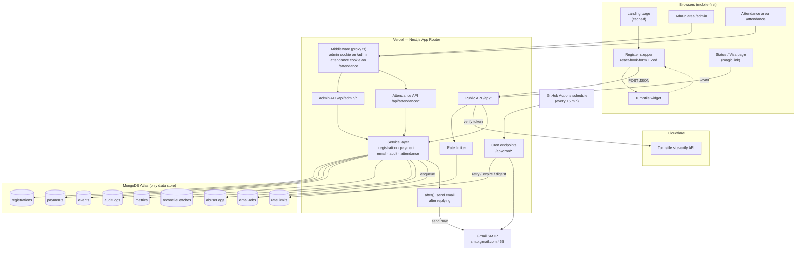
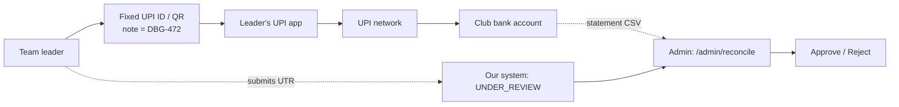
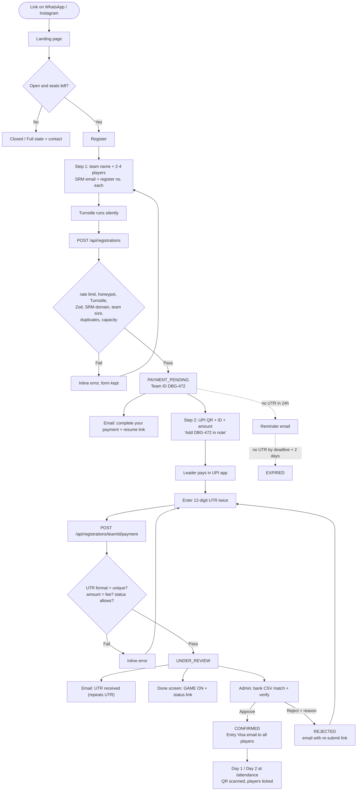
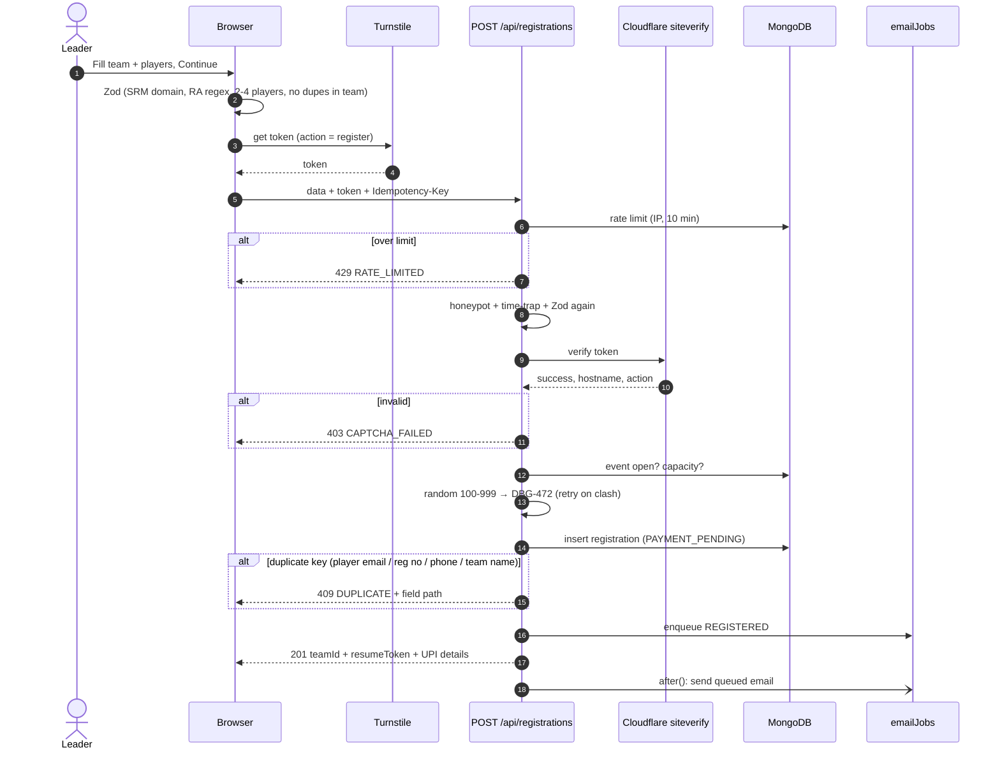
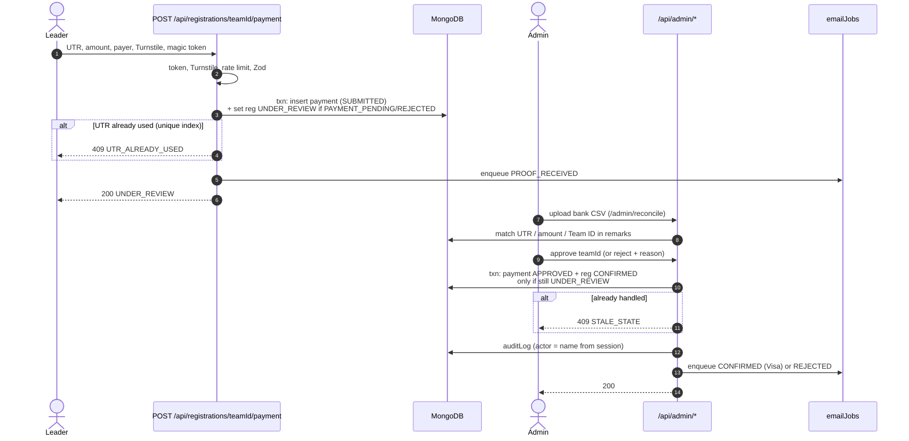
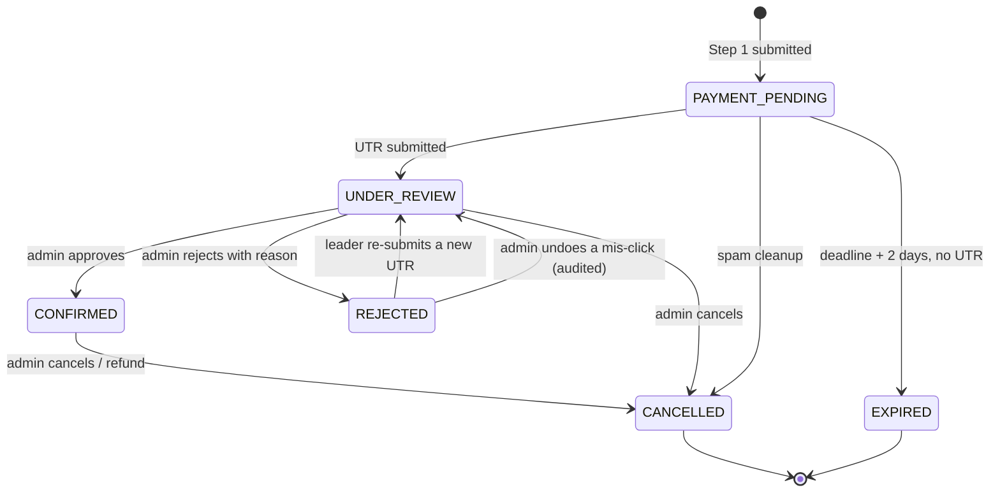
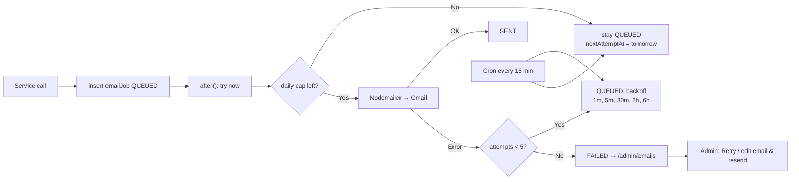
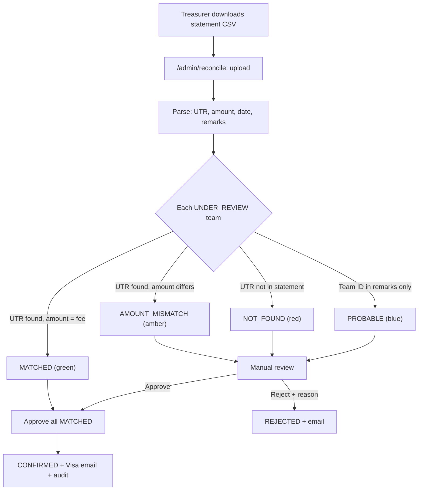
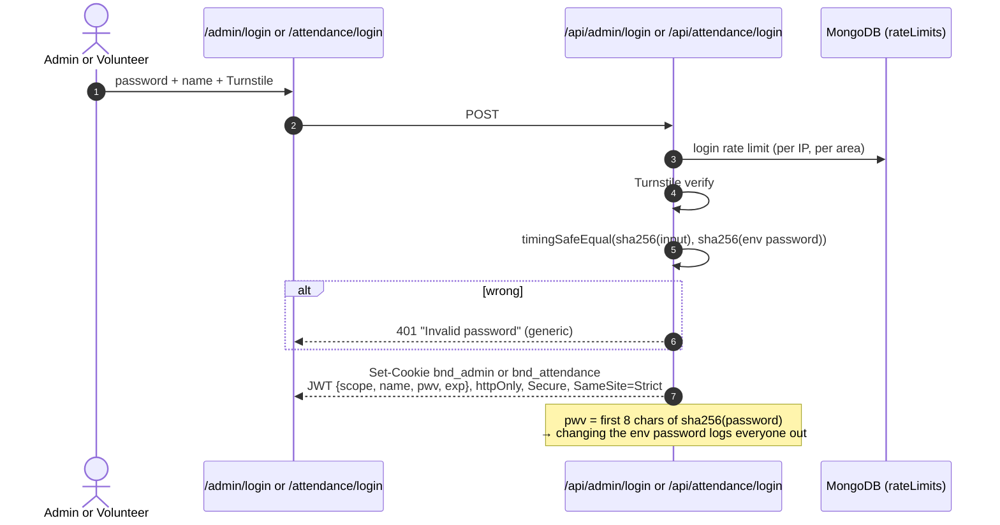
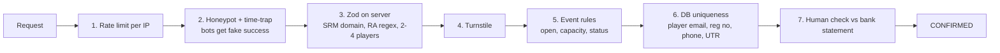

# SRM DBUG Labs — Borderland Event Registration Platform
### Final Design Document (merged)

> **Theme:** Alice in Borderland · **Stack:** Next.js (App Router, TypeScript) · MongoDB Atlas · Nodemailer + Gmail SMTP · Cloudflare Turnstile · Fixed UPI (manual verification) · Vercel
> **Merged from:** `Event_Registration_Design_1.md` (Design Pack) + `dbug-labs-event-platform-architecture-1.md` (Architecture Spec). Where the two drafts disagreed, the choice made is listed in [Appendix A](#appendix-a--what-changed-from-the-two-drafts).
> **Status:** Final v1 · UI specifics pending (landing layout is structure-only)

---

## 0. Locked Constraints (must not be changed without the organisers)

These come straight from the organisers and **override anything else in this document**.

| # | Constraint | What it means in the build |
|---|---|---|
| C1 | **SRM email ID is required** | Every player (leader + members) must give an SRM email (`@srmist.edu.in`). Any other domain is rejected by the form and the server |
| C2 | **No college name field** | The event is SRM-only, so there is no college field, no college dropdown and no college KPI |
| C3 | **Register number is required** | Every player gives their SRM register number (e.g. `RA2311003010123`). It is unique per event, so one student can be in only one team |
| C4 | **Team size is 2–4** | A team is 1 leader + 1 to 3 members. Solo registration is not allowed |
| C5 | **No payment screenshot** | Payment proof is the **12-digit UTR only** (+ amount, + optional payer UPI ID/name). No file upload anywhere in the participant flow |
| C6 | **No R2 / no external file storage** | No Cloudflare R2, no Cloudinary, no S3, no GridFS for uploads. The UPI QR is generated from the UPI ID (or committed as a static file in `/public`) |
| C7 | **Admin has its own route** | The admin panel lives under `/admin/*` (pages) and `/api/admin/*` (APIs), separate from all public routes and not linked from the public site |
| C8 | **Attendance has its own route, separate from admin** | Attendance lives under `/attendance/*` and `/api/attendance/*`. An attendance login **cannot** open admin pages, and an admin login does **not** open attendance pages |
| C9 | **Admin and attendance are password-protected, passwords in env** | `ADMIN_PASSWORD` and `ATTENDANCE_PASSWORD` are Vercel environment variables. No admin-user collection, no NextAuth, no sign-up |
| C10 | **Team ID is `DBG-XXX`, a random 3-digit number** | e.g. `DBG-472`. Random number from 100 to 999, unique per event, never reused. No running counter |
| C11 | **Attendance QR is simple: it holds only the team code** | The QR is plain text `DBG-472`. No link, no signature, no personal data. The `/attendance` scanner looks the code up |

---

## 1. Summary of Decisions

| Item | Decision |
|---|---|
| Expected scale | 200–600 teams (the random 3-digit Team ID allows at most 900), peak ~50 submissions/hour right after the link is shared |
| Who can register | SRM students only (SRM email + register number for every player) |
| Team | 2–4 players, team name required, one DBG Team ID per team |
| Payment | Fixed UPI (no gateway). Proof = **UTR only**, verified by an admin against the bank statement (CSV auto-matching helps) |
| Bot protection | Cloudflare Turnstile (Managed) + honeypot + time-trap + per-IP rate limit + server-side Zod validation |
| Email | Nodemailer via Gmail SMTP (App Password), sent through an **outbox collection** with retries |
| Hosting | Vercel (Next.js) + MongoDB Atlas (M0/M10). No other storage service |
| Team ID | `DBG-XXX`: `DBG-` + a **random 3-digit number** (e.g. `DBG-472`), unique per event (§4, C10) |
| Entry & attendance | **Entry Visa** with a plain attendance QR that holds only the team code (C11), scanned on Day 1 and Day 2 at `/attendance` (§4) |
| Registration flow | **2-step stepper**: (1) team details → server creates the Team ID, (2) pay with the Team ID in the UPI note → submit UTR |
| Access control | Two separate password-protected areas: `/admin` (`ADMIN_PASSWORD`) and `/attendance` (`ATTENDANCE_PASSWORD`) |

---

## Table of Contents

0. [Locked Constraints](#0-locked-constraints-must-not-be-changed-without-the-organisers)
1. [Summary of Decisions](#1-summary-of-decisions)
2. [PRD — Product Requirements](#2-prd--product-requirements)
3. [Registration Form — Fields & Validation](#3-registration-form--fields--validation)
4. [Team ID, Entry Visa & Attendance](#4-team-id-bnd-entry-visa--attendance)
5. [HLD — High-Level Design](#5-hld--high-level-design)
6. [Workflow Diagrams](#6-workflow-diagrams)
7. [LLD — Low-Level Design](#7-lld--low-level-design)
8. [Bot, Spam & Security](#8-bot-spam--security)
9. [Admin Panel, Attendance Panel & KPIs](#9-admin-panel-attendance-panel--kpis)
10. [CRUD & Deletion Policy](#10-crud--deletion-policy)
11. [Edge Cases & Error Handling](#11-edge-cases--error-handling)
12. [Build Plan — Step by Step](#12-build-plan--step-by-step)
13. [Testing, Launch Checklist & Open Questions](#13-testing-launch-checklist--open-questions)
14. [Glossary](#14-glossary-for-newcomers)
- [Appendix A — What changed from the two drafts](#appendix-a--what-changed-from-the-two-drafts)

> **New to this?** Read §0 and §2 (what we're building), look at the diagrams in §6, then follow §12 step by step. Unfamiliar words are explained in §14.

---

## 2. PRD — Product Requirements

### 2.1 Problem statement

SRM DBUG Labs needs a themed website where SRM students can discover the event, register their team, pay the entry fee via a fixed UPI ID, and receive confirmation — while organisers verify payments and manage teams from an admin panel, and volunteers mark attendance on event days. Today this runs on Google Forms + spreadsheets + UPI screenshots over WhatsApp: slow, error-prone, no single source of truth, no fraud prevention, and no automated communication.

### 2.2 Goals & non-goals

| Goals | Non-goals (v1) |
|---|---|
| G1. A team leader goes from link → registered in < 3 minutes of their own time | Payment gateway / automatic bank-side verification |
| G2. Zero lost payments: every UTR is traceable to exactly one team | Participant login/accounts (magic links instead) |
| G3. Admin verifies a payment in < 30 seconds per team (seconds, in bulk, with bank CSV) | Payment screenshots or any file uploads (C5) |
| G4. Bot/spam submissions blocked without hurting real users | External file storage — R2, Cloudinary, S3 (C6) |
| G5. Organisers see live KPIs without exporting to Excel | Participants from outside SRM / college field (C1, C2) |
| G6. Attendance takes < 10 seconds per team at the desk | Refund automation, waitlist, mobile app, multi-event SaaS |
| G7. Theme is CSS/content only — swappable for future events | Per-user admin accounts / roles (shared env passwords instead, C9) |

### 2.3 Personas

| Persona | Needs | Where they work |
|---|---|---|
| **Team leader** (SRM student, mobile-first, college Wi-Fi/4G) | Quick form, clear fee & UPI, proof that payment was received, Entry Visa | Public site |
| **Team member** | Gets the Entry Visa, shows up with SRM ID card | Email only |
| **Admin** (club core team, 3–5 people sharing `ADMIN_PASSWORD`) | Pending-payment queue, bank matching, approve/reject, edit, export, settings, KPIs | `/admin` |
| **Attendance volunteer** (event days, sharing `ATTENDANCE_PASSWORD`) | Scan QR → see team → tick players present | `/attendance` |

### 2.4 User stories

| ID | As a… | I want to… | So that… | Priority |
|---|---|---|---|---|
| US-01 | participant | see event details, fee, date and a countdown | I decide to register | P0 |
| US-02 | team leader | fill a short form for my 2–4 player team with instant validation | I don't get errors after submitting | P0 |
| US-03 | team leader | get a DBG Team ID before paying | I can put it in my UPI note | P0 |
| US-04 | team leader | scan/copy the UPI ID and see the exact amount | I pay correctly | P0 |
| US-05 | team leader | submit my 12-digit UTR (no screenshot) | organisers can verify us | P0 |
| US-06 | team leader | receive an email at every status change | I know where we stand | P0 |
| US-07 | team leader | resume payment later from an email link | closing the tab doesn't lose our spot | P0 |
| US-08 | team leader (rejected) | re-submit a corrected UTR via link | we don't have to register again | P1 |
| US-09 | whole team | receive the Entry Visa with a QR once confirmed | entry on both days is quick | P0 |
| US-10 | admin | see the pending queue oldest-first with UTR + bank-match result | I work fast | P0 |
| US-11 | admin | upload the bank statement CSV and see auto-matched UTRs | I bulk-approve safely | P1 |
| US-12 | admin | see KPIs (funnel, revenue, pending, attendance) | I track progress | P0 |
| US-13 | admin | edit/soft-delete teams, resend emails, export CSV | I fix mistakes and share lists | P0 |
| US-14 | admin | change fee/deadline/capacity/UPI ID without a redeploy | ops don't need a developer | P0 |
| US-15 | admin | see who did what (audit log, by name typed at login) | disputes can be resolved | P1 |
| US-16 | volunteer | scan a QR and mark which players are present for Day 1 or Day 2 | attendance takes under 10 seconds | P0 |
| US-17 | volunteer | search by Team ID / leader phone / register number if there's no QR | no one is stuck at the desk | P0 |
| US-18 | admin | see Day 1 / Day 2 attendance and no-shows | I know who actually came | P1 |

### 2.5 Functional requirements

| ID | Requirement |
|---|---|
| FR-01 | Landing page shows event data from the database (cached, refreshed when an admin changes settings) |
| FR-02 | Registration opens/closes automatically on `registrationOpensAt` / `registrationClosesAt`; admin can force-close |
| FR-03 | Capacity: new registrations blocked when `confirmed + underReview ≥ capacity`; show "Registrations full" |
| FR-04 | Step 1 accepts a team of **2–4 players**, each with **name, SRM email (`@srmist.edu.in`), SRM register number**; leader also gives a WhatsApp phone |
| FR-05 | Step 1 creates a registration in `PAYMENT_PENDING` and returns the `teamId` + a signed resume token |
| FR-06 | Step 2 accepts **UTR + amount (+ optional payer UPI/name)** only — **no file upload** → status `UNDER_REVIEW` |
| FR-07 | Uniqueness per event: every player's SRM email and register number appear in **at most one team**; leader phone unique; team name unique; UTR unique **forever** (across all attempts, including rejected ones) |
| FR-08 | Every public form passes Turnstile server verification (hostname + action checked) |
| FR-09 | Rate limits: 5 registration attempts / IP / 10 min, 20 / IP / day; login 5 / IP / 15 min (admin and attendance separately) |
| FR-10 | Emails on: registered (pay-pending), proof received, confirmed (Entry Visa + QR, to all players), rejected (with re-submit link), unpaid reminder after 24 h |
| FR-11 | Status transitions follow the state machine (§6.4); illegal transitions return 409 |
| FR-12 | Payment reconciliation: upload bank CSV → match on UTR (+ amount, + Team ID in remarks) → bulk-approve MATCHED |
| FR-13 | Public status page via magic link shows current status and the next action |
| FR-14 | **Admin area** at `/admin/*` + `/api/admin/*`, protected by `ADMIN_PASSWORD` from env |
| FR-15 | **Attendance area** at `/attendance/*` + `/api/attendance/*`, protected by `ATTENDANCE_PASSWORD` from env; completely separate session from admin |
| FR-16 | Every team gets a unique Team ID `DBG-XXX` (random 3-digit number, 100–999) at Step 1; numbers are never reused |
| FR-17 | An Entry Visa (page + email image + PDF) is issued automatically on CONFIRMED and shows REVOKED if the team is cancelled |
| FR-18 | The Visa carries a plain attendance QR containing **only the team code** (e.g. `DBG-472`). It is read by the scanner inside the logged-in **attendance** area; scanning it with a normal camera just shows the text |
| FR-19 | Attendance is saved **per day** (Day 1, Day 2) with the time, the volunteer's name and the players present. A second scan on the same day warns and allows editing |
| FR-20 | Admin shows attendance KPIs per day + a no-show list; CSV export includes attendance columns |

### 2.6 Non-functional requirements

| Area | Target |
|---|---|
| Performance | Landing LCP < 2.5 s on 4G; API p95 < 500–800 ms |
| Scalability | Stateless route handlers, MongoDB indexes, Vercel serverless; burst of ~500 concurrent submits |
| Availability | ~99.5 % (Vercel + Atlas; no custom server, no multi-region) |
| Security | OWASP Top-10 basics, httpOnly session cookies, CSP, no PII in logs, secrets only in env, rate-limited logins |
| Data integrity | DB-level unique indexes; atomic, conditional status transitions |
| Privacy (India DPDP Act 2023) | Explicit consent, minimum data (no college, no screenshots), deletion on request, PII only visible to admins |
| Accessibility | WCAG 2.1 AA: labels, focus states, contrast on the dark theme, errors announced via `aria-live` |
| Mobile | Mobile-first (traffic comes from WhatsApp/Instagram); attendance screen built for a phone held in one hand |
| Observability | Structured logs (requestId), `emailJobs`, `auditLogs`, `abuseLogs` collections, Vercel logs |

### 2.7 Success metrics

| Metric | Target |
|---|---|
| Form completion (Step 1 started → submitted) | ≥ 70 % |
| Payment completion (Step 1 → Step 2 submitted) | ≥ 80 % |
| Median verification time (UNDER_REVIEW → CONFIRMED) | < 12 h |
| Spam registrations reaching the DB | < 1 % |
| Email delivery failures after retries | 0 |
| Attendance time per team at the desk | < 10 s |

### 2.8 Acceptance criteria

- The form cannot submit without passing Turnstile + all required fields + server validation.
- A non-SRM email (anything other than `@srmist.edu.in`) is rejected — on the form **and** by the API.
- A team of 1 or 5+ players is rejected — on the form **and** by the API.
- A register number or SRM email already in another team is rejected with a clear message naming the player slot.
- The same UTR can never be attached to two teams, even if the first attempt was rejected (unique index).
- Approve only works if the team is still `UNDER_REVIEW` and writes an audit entry; two admins clicking at once → second gets `STALE_STATE`.
- Every state transition queues exactly one email (idempotent — retries never double-send).
- Any `/admin` or `/api/admin` request without a valid **admin** cookie → redirect to `/admin/login` (pages) or 401 (APIs). Same for `/attendance` with the **attendance** cookie. An attendance cookie on an admin route → 401, and vice versa.

### 2.9 Risks & mitigations

| Risk | Impact | Mitigation |
|---|---|---|
| Fake/typo'd UTR (no screenshot to look at) | Unpaid entry or wrong rejects | **UTR must appear on the real bank statement** before approve (CSV reconciliation); Team ID in the UPI note gives a second match key; proof email repeats the UTR so typos get noticed |
| Someone submits another person's real UTR | Revenue loss / dispute | Unique UTR (first claim wins) + amount check + Team ID in bank remarks; disputed cases handled manually with audit trail |
| One student in two teams | Unfair entries | Unique index on every player's SRM email and register number per event |
| Shared admin password leaks | Unauthorised access | Strong random password in env, login rate limit + lockout, name recorded per session in audit log, rotate by changing env (all sessions die, §7.7-A) |
| Gmail daily limit (~500/day personal, ~2,000 Workspace) | Emails stop mid-launch | Outbox with retries + daily cap; Visa email counts once per recipient — see §5.7 |
| Viral traffic spike | Slow site | Landing is static/ISR; API is tiny; Atlas connection reuse |
| Leader typos an email | Never receives Visa | Only SRM domain accepted; review screen shows all emails; admin can edit & resend |
| Wrong amount paid | Disputes | Amount field + bank CSV amount check; "Amount mismatch" reject template |

### 2.10 Milestones

| Week | Deliverable |
|---|---|
| W1 | DB schema + indexes, Zod schemas, Step 1 + Step 2 APIs, Turnstile, rate limit |
| W2 | Landing (themed UI), stepper form, emails via outbox |
| W3 | Admin area: password login, list/detail, approve/reject, KPIs, export, settings |
| W4 | CSV reconciliation, Entry Visa, attendance area, load test, launch checklist |

---

## 3. Registration Form — Fields & Validation

### 3.1 Research: patterns we took from similar platforms

(Unstop, Devfolio, Konfhub/Townscript-style ticketing, Google-Form fest registrations.)

| Pattern | What we take from it |
|---|---|
| Short first step | Step 1 is team details only; payment is a separate step |
| Registration ID early | The **DBG Team ID** is created after Step 1 and goes into the UPI note → easy manual matching |
| Inline validation | `react-hook-form` + one shared **Zod** schema on client and server |
| Consent checkbox | Required, links to rules + refund policy + privacy |
| Only ask what you'll use | No college (C2), no gender/DOB/address, no screenshot (C5) |
| Manual UPI verification | We add **UTR uniqueness** + **bank CSV reconciliation** so it doesn't become a spreadsheet nightmare |
| Status visibility | Magic-link status page (`/r/[teamId]?t=…`) — no accounts |
| Ticket/QR on confirmation | **Entry Visa** with a plain QR holding the team code |

### 3.2 Step 1 — Team details

**Team block**

| # | Field | Type | Required | Validation rule | Error message (inline) |
|---|---|---|---|---|---|
| 1 | Team name | text | ✅ | 3–30 chars, letters/numbers/spaces/`-_`, unique per event (case-insensitive) | "That team name is taken" |
| 2 | Number of players | segmented control 2 / 3 / 4 | ✅ | integer 2–4 (C4); controls how many player blocks show | "A team must have 2 to 4 players" |

**Player block** — shown once for the leader (P1) and once for each member (P2–P4)

| # | Field | Type | Required | Validation rule | Error message (inline) |
|---|---|---|---|---|---|
| 3 | Full name | text | ✅ | 2–60 chars, letters/spaces/`.'-` only, trimmed, collapse double spaces | "Enter the full name (letters only)" |
| 4 | **SRM email** | email | ✅ | lowercase + trim, must match `^[a-z0-9._%+-]+@srmist\.edu\.in$` (domain from `ALLOWED_EMAIL_DOMAIN`, C1) | "Use your SRM email (@srmist.edu.in)" |
| 5 | **Register number** | text | ✅ | uppercase + trim, SRM format `^RA\d{13}$` (e.g. `RA2311003010123`) (C3) — confirm format, §13.3 | "Enter your SRM register number, e.g. RA2311003010123" |
| 6 | Phone (WhatsApp) | tel | ✅ leader · ⬜ members | Indian mobile `^[6-9]\d{9}$` after stripping `+91`, spaces, `-` | "Enter a 10-digit Indian mobile number" |
| 7 | Year of study | select | ✅ leader · ⬜ members | enum: 1, 2, 3, 4, 5, PG | "Select the year" |
| 8 | Department / Branch | text | ⬜ | ≤ 60 chars | — |

**Team-level rules (checked in Zod + again by DB indexes)**

- No two players in the same team share an SRM email or a register number → "Player 3 has the same register number as Player 1".
- No player's SRM email or register number already belongs to another team in this event → "Player 2 (RA23…) is already registered in another team".
- There is **no college field** (C2).

**Other fields**

| # | Field | Type | Required | Validation | Notes |
|---|---|---|---|---|---|
| 9 | How did you hear about us? | select | ⬜ | Instagram / WhatsApp / Friend / Poster / Other | Feeds a KPI |
| 10 | Consent | checkbox | ✅ | must be `true` | "Accept the rules & refund policy to continue" |
| — | Honeypot `website` | hidden text | — | must be empty | silent fake success |
| — | Turnstile token | hidden | ✅ | verified server-side (action `register`) | "Verification failed, please retry" |

### 3.3 Step 2 — Payment proof (UTR only, no screenshot)

| # | Field | Type | Required | Validation rule | Error message |
|---|---|---|---|---|---|
| 1 | UPI Transaction ID / UTR | text | ✅ | exactly 12 digits `^\d{12}$`; unique across **all** payment attempts ever | "UTR must be the 12-digit number from your payment app" / "This UTR is already used" |
| 2 | Confirm UTR | text | ✅ | must equal field 1 (no paste blocking — just a second look) | "UTRs don't match" |
| 3 | Amount paid | number | ✅ | must equal `event.fee` (prefilled, read-only + confirm tick) | "Amount must be ₹{fee}" |
| 4 | Paid from (UPI ID or name) | text | ⬜ | ≤ 60 chars | — (helps admin match) |
| 5 | Paid at (approx. time) | datetime | ⬜ | within registration window | — (helps admin match) |
| — | Turnstile token | hidden | ✅ | action `payment` | — |

> **Help text under UTR:** "GPay → payment → *UPI transaction ID* · PhonePe → *UTR* (not the T-number) · Paytm → *UPI Ref No.*"
> The "Confirm UTR" field replaces the screenshot's role as a typo check. Because there's **no screenshot**, the bank statement (§7.7-I) is the only real proof — admins must not approve on UTR alone without checking it.

### 3.4 Validation & error-handling rules

1. **Rules written once, used twice** — the same Zod schemas run in the form and on the server. The server never trusts the browser.
2. Validate when the user leaves a field, not while they type the first time.
3. **Clean first:** trim, lowercase emails, strip `+91`/spaces from phones, uppercase register numbers.
4. Errors next to the field + a summary on submit + focus the first wrong field.
5. Server errors name the field (e.g. `players[2].regNo: already registered`) so the form shows them in the right place.
6. **Never clear the form on error**; keep a local draft so a refresh doesn't wipe it.
7. Disable submit + spinner while sending; Idempotency-Key per form session.
8. Human wording, no technical codes in the UI.

---

## 4. Team ID (`DBG`), Entry Visa & Attendance

### 4.1 Team ID — `DBG-XXX`

| Item | Decision |
|---|---|
| Format | `DBG-` + a **random 3-digit number** from 100 to 999 (e.g. `DBG-472`). Always exactly 3 digits, no leading zeros |
| One per | **Team**. Players shown as `DBG-472 · P1` … `P4` |
| When | End of **Step 1**, so the leader can type it in the UPI note |
| How | Pick a random number with `crypto.randomInt(100, 1000)` → insert the registration. `teamId` has a **unique index**, so if the number is already taken the insert fails and the server tries a new random number (up to 20 tries, then `INTERNAL`). No counter collection needed |
| Pool size | 900 possible IDs per event. **Keep capacity well below 900 teams** (≤ 600 recommended) — as the pool fills, clashes and retries become more common. If more teams are ever needed, switch to 4 digits (`DBG-XXXX`) |
| No reuse | A number stays taken even if the team expires, is cancelled or is soft-deleted, so an old ID never points to a new team |
| Where it shows | Success screen, every email subject, status page, Entry Visa, UPI note, attendance QR, admin table/search, CSV export, attendance screen |
| Safety | The ID is short and easy to guess, so it **alone never opens anything private** — status/Visa pages need the signed token from the email, and the attendance QR only works with the scanner inside the logged-in attendance area |

### 4.2 Entry Visa

| Item | Decision |
|---|---|
| When issued | When an admin **confirms the payment** (CONFIRMED). Before that: *"Visa pending issuance"* |
| Delivery | Confirmation email (image + link) to the leader, CC all members' SRM emails; Visa page `/visa/DBG-472?t=…`; downloadable PNG/PDF so it works offline at the gate |
| One visa per | Team |
| Status | **VALID** once confirmed · **REVOKED** if cancelled (scanning the QR then shows a red "not confirmed" card) |
| Storage | **Nothing stored** — the Visa image/PDF and QR are rendered on request from the registration data (C6) |

**Printed on the Visa:** Team ID · team name · players (2–4 names + register numbers, leader marked) · event days/reporting time/venue · status VALID · starting Visa Points 03 · attendance QR · day stamps (`DAY 1 ✓ 09:12`, `DAY 2 ✓ 08:55`) once marked.

### 4.3 Attendance QR — how it works

Kept deliberately simple: **the QR holds only the team code**, as plain text.

| Item | Decision |
|---|---|
| QR content | Just the text `DBG-472`. No URL, no signature, no personal data |
| How it's made | `qrcode` library turns the team code into a QR when the Visa is shown or emailed. Nothing is stored (C6) |
| Who can use it | Only the **scanner inside `/attendance`** (logged in with `ATTENDANCE_PASSWORD`) does anything with it. The scanner reads the text, then calls `/api/attendance/teams/DBG-472` |
| Scanned with a normal phone camera | It only shows the text `DBG-472`, which is already printed on the Visa, so nothing leaks |
| Admin session | Does **not** mark attendance (C8). Admins see attendance read-only in `/admin` |
| Trade-off | Anyone could make a QR for any team code, since the QR isn't signed. That's acceptable because the QR only **finds** the team: the volunteer still sees the team card and checks every player's **SRM ID card** against the names and register numbers before tapping *Mark present* |

**At the desk (each day):**

1. Volunteer opens `/attendance`, logs in with the attendance password + their name, picks **Day 1** / **Day 2** (defaults to today).
2. Scans the team's QR with the in-page camera scanner. The QR is just the team code (`DBG-472`), so the scanner looks that code up.
3. Screen shows the team card: Team ID, team name, status (**green** if CONFIRMED, **red** otherwise), players with register numbers and checkboxes (all ticked).
4. Volunteer checks SRM ID cards, unticks absentees, taps **Mark present**.
5. Saved: day, time, volunteer name, players present. The Visa gets that day's stamp.
6. Second scan the same day → *"Already marked at 09:12 by Riya"*; late arrivals can still be added.

**Fallbacks:** no QR / dead phone → search by Team ID, leader phone or any player's register number. No internet at the desk → exported CSV, enter later.

**Link to Game Day:** Day 2 attendance = *"Check-in & Visa issuance"*. Every team present starts with 3 Visa Points. Game scoring is outside this system.

---

## 5. HLD — High-Level Design

### 5.1 Architecture



Payment money flow (the app is **never** connected to the bank):



The system only records what the participant **claims** they paid. UI copy, emails and status names always separate **"payment submitted"** (`UNDER_REVIEW`) from **"payment verified by organiser"** (`CONFIRMED`).

### 5.2 Components

| Part | What it does | Built with |
|---|---|---|
| Landing page | Event info, theme, countdown, fee, FAQ, Register | Next.js page, cached |
| Register page (stepper) | Step 1 team → Step 2 UTR → Done | react-hook-form + Zod + Turnstile |
| Status / Visa pages | Status + next action; Entry Visa with QR | Magic link from email |
| Public API | Receive form data, run checks, call services | Route handlers under `app/api/` |
| Admin API | Everything the admin panel does | Route handlers under `app/api/admin/` |
| Attendance API | Team lookup + mark attendance only | Route handlers under `app/api/attendance/` |
| Services | Real logic: create registration, submit UTR, approve, reject, attendance, emails | Plain TS functions in `lib/services/` |
| Area guard | Two separate password logins → two separate signed cookies | `jose` + middleware (§7.7-A) |
| Turnstile check | Confirms the user is human | Cloudflare siteverify |
| Rate limiter | Too many tries from one IP | Counter collection in MongoDB (no Redis needed) |
| UPI QR | Shows the payment QR | Generated from the UPI ID with `qrcode` — **no stored image** (C6) |
| Email queue | Reliable sends + retries | `emailJobs` + Nodemailer + Gmail |
| Audit log | Who changed what | `auditLogs` (actor = name typed at login) |

### 5.3 Key design decisions

| # | Decision | Why | Rejected alternative |
|---|---|---|---|
| D1 | Two-step registration (team first, payment second) | Team ID goes in UPI note; abandoned-payment leads get reminders; resume link survives Android killing the tab | One long form |
| D2 | Cloudflare Turnstile (Managed) | Free, privacy-friendly, mostly invisible; token single-use, 5 min | reCAPTCHA v3 |
| D3 | **UTR-only proof, no screenshot** (C5) | Screenshots are easy to fake and add upload/storage/privacy cost; the bank statement is the real proof anyway | Screenshot + UTR |
| D4 | **Separate `payments` collection** (one registration → many attempts) | Rejected attempts keep their UTR forever, so a rejected UTR can never be reused by another team; full history | Payment embedded on registration |
| D5 | Bank CSV reconciliation | The only real verification without screenshots; turns 200 checks into one bulk approve | Scrolling the UPI app |
| D6 | Email outbox | Registration never fails because Gmail failed; nothing silently lost | Fire-and-forget |
| D7 | **No file storage at all** (C6) | QR generated from UPI ID; Visa rendered on request; nothing uploaded by users | R2 / Cloudinary / GridFS |
| D8 | Magic links, no participant accounts | No passwords to reset; HMAC-signed, one team per link | NextAuth for participants |
| D9 | **Two env passwords, two separate areas** (C7–C9) | Tiny known group of admins/volunteers; nothing to manage; attendance volunteers can't touch payments or PII beyond the team card | Admin user collection + RBAC roles + NextAuth |
| D10 | Event config in DB (`events` doc) | Change fee/deadline/capacity/UPI ID without redeploy | Hard-coded / env |
| D11 | Soft delete | Deleted spam still blocks duplicates; restorable | Hard delete |

### 5.4 Route map (public vs admin vs attendance)

**Public** — no login

| Route | Access | Purpose |
|---|---|---|
| `/` | public (cached) | Landing page |
| `/register` | public | Step 1 → Step 2 → Done |
| `/register/pay/[teamId]` | magic token | Resume payment / re-submit UTR after rejection |
| `/r/[teamId]` | magic token | Status page |
| `/visa/[teamId]` | magic token | Entry Visa + QR (PNG/PDF download) |
| `/rules`, `/refund-policy`, `/privacy` | public | Linked from consent |

**Admin** — `ADMIN_PASSWORD`, cookie `bnd_admin` (path `/`, checked only on admin routes)

| Route | Purpose |
|---|---|
| `/admin/login` | Password + "your name" (for audit) |
| `/admin` | KPI dashboard |
| `/admin/registrations` | List / filter / bulk actions |
| `/admin/registrations/[teamId]` | Detail, UTR + bank match, approve/reject, edit, timeline |
| `/admin/reconcile` | Upload bank CSV, auto-match |
| `/admin/attendance-report` | **Read-only** Day 1/Day 2 counts + no-show list (marking happens only in `/attendance`) |
| `/admin/emails` | Email outbox, retry failed |
| `/admin/settings` | Event settings, audit log |

**Attendance** — `ATTENDANCE_PASSWORD`, cookie `bnd_attendance`

| Route | Purpose |
|---|---|
| `/attendance/login` | Password + volunteer name |
| `/attendance` | Day switch, QR scanner, manual search, live counter |
| `/attendance/[teamId]` | Team card → tick players → Mark present (opened after a scan or a search) |

**Separation rules**
- Middleware checks `bnd_admin` for `/admin/*` + `/api/admin/*`, and `bnd_attendance` for `/attendance/*` + `/api/attendance/*`. The JWT carries `scope: "admin"` or `scope: "attendance"`, and **each route handler re-checks the scope** (middleware alone is not trusted).
- Neither area is linked from the public site; both send `X-Robots-Tag: noindex` and are in `robots.txt` disallow.
- The attendance API returns only what the desk needs: Team ID, team name, status, player names + register numbers, attendance so far. No emails, phones or payment data.

### 5.5 Landing page layout (structure — visuals come with the UI)

Motifs: playing cards / suits (♠ physical, ♣ teamwork, ♦ intellect, ♥ psychological), "Visa" countdown, deserted-city neon, **GAME CLEAR / GAME OVER** states.

| # | Section | Content | Theme hook |
|---|---|---|---|
| 1 | Nav | Logo, About, Games, Timeline, FAQ, **Register** (sticky on mobile) | — |
| 2 | Hero | Event name, tagline, date · venue, **"Enter the Borderland"**, countdown | "Your visa expires in 03d 12h" |
| 3 | About | 2–3 lines | Rules card flip |
| 4 | Games / Tracks | Each round as a playing card | Suit = category, number = difficulty |
| 5 | Timeline | Open → close → Day 1 → Day 2 → results | "Stages" |
| 6 | Entry fee & prizes | Fee per team, what's included, prizes; "Teams of 2–4 · SRM students only" | "Entry cost to the game" |
| 7 | How to register | Form your team → Pay via UPI with Team ID in note → Get your Entry Visa | Sets expectations for manual verification |
| 8 | FAQ | Verification time, refund policy, team rules, SRM email requirement, contact | Accordion |
| 9 | Footer | Club socials, contact, rules/privacy links | — |

States from the `events` doc: **Not open yet**, **Open**, **Almost full** (> 90 %), **Closed / Full** ("GAME OVER — registrations closed"). Hero art via `next/image` (WebP/AVIF), CSS-only animations, `prefers-reduced-motion` respected.

### 5.6 Security overview

| Area | What we do |
|---|---|
| Connection | HTTPS (Vercel); CSP allows only our origin + Turnstile |
| Bots | Turnstile + honeypot + time-trap + rate limits |
| Input | Zod on every mutating route; unknown fields stripped; parameterised queries only (no NoSQL injection) |
| Files | **None accepted** (C5, C6) — removes the whole upload attack surface |
| Admin / attendance login | Env passwords compared in constant time; httpOnly + Secure + SameSite=Strict cookie; 8 h admin / 14 h attendance session; 5 wrong tries → 15-min lock per IP; Turnstile on both login forms |
| CSRF | SameSite=Strict cookies + Origin header check on every state-changing admin/attendance route |
| Output | Escape user text in emails; CSV-injection-safe exports |
| Secrets | Only in Vercel env vars; Gmail **App Password**; nothing sensitive in `NEXT_PUBLIC_*` |
| Privacy | Consent, minimum data, no PII in logs, attendance area sees minimal fields |

### 5.7 Will it handle the load?

- Yes. Landing is cached; the API does two small writes per team.
- **Email is the real limit.** Gmail counts **recipients**, not messages. Per team: Registered (1) + Proof received (1) + Confirmed Visa (leader + up to 3 CC = up to 4) ≈ 6 recipients. 1,000 teams ≈ 6,000 recipient-sends vs ~500/day on a personal account. The outbox spreads them automatically (`EMAIL_DAILY_CAP`). **Strongly prefer a Google Workspace sender (~2,000/day)**, or set `VISA_CC_MEMBERS=false` to send the Visa only to the leader during launch week.
- Reuse one cached MongoDB connection across invocations (Atlas M0 connection limit).

---

## 6. Workflow Diagrams

### 6.1 End-to-end journey



### 6.2 Sequence — Step 1 (create team registration)



### 6.3 Sequence — Step 2 (UTR) & admin verification



### 6.4 State machine



Payment attempts have their own small state: `SUBMITTED → APPROVED | REJECTED`. Attendance is **not** a status — it's a per-day list on the registration.

| From → To | Who | Side-effects |
|---|---|---|
| — → PAYMENT_PENDING | leader | email `REGISTERED` |
| PAYMENT_PENDING / REJECTED → UNDER_REVIEW | leader | new `payments` doc, email `PROOF_RECEIVED`, counts in admin digest |
| UNDER_REVIEW → CONFIRMED | admin | payment APPROVED, `verifiedBy/At`, **Visa issued**, email `CONFIRMED` (Visa + QR), audit |
| UNDER_REVIEW → REJECTED | admin | reason required, payment REJECTED, `rejectCount++`, email `REJECTED`, audit |
| REJECTED → UNDER_REVIEW (undo) | admin | reverts last payment to SUBMITTED, audit, no email |
| any → CANCELLED | admin | reason, Visa REVOKED, optional email, audit |
| PAYMENT_PENDING → EXPIRED | cron | optional email |
| Attendance Day 1 / Day 2 | volunteer (attendance area) | attendance entry, Visa stamp, audit |

### 6.5 Email outbox



### 6.6 Reconciliation



### 6.7 Sequence — admin / attendance login (same pattern, separate areas)



---

## 7. LLD — Low-Level Design

> How to build each piece, in plain steps. Hand these to your AI coding tool one piece at a time, as described in §12.

### 7.1 Packages

| Package | For |
|---|---|
| `next` (App Router) + TypeScript + Tailwind | Site + API in one project |
| `mongodb` (official driver) or `mongoose` | Database |
| `zod` | Shared validation rules |
| `react-hook-form` + `@hookform/resolvers` | Form state + inline errors (`useFieldArray` for 2–4 players) |
| `@marsidev/react-turnstile` | Turnstile widget |
| `nodemailer` | Gmail SMTP |
| `jose` | Signed session cookies (admin + attendance) and magic links |
| `qrcode` | UPI payment QR + attendance QR (plain text `DBG-472`; generated, never stored) |
| `@yudiel/react-qr-scanner` (or `html5-qrcode`) | Camera scanner on `/attendance` |
| `@react-pdf/renderer` or `satori` + `@resvg/resvg-js` | Entry Visa PDF / PNG on request |
| `papaparse` | Bank statement CSV |
| `recharts` | Admin charts |
| `@tanstack/react-table` | Admin table |

**Not used (removed by constraints):** `sharp`, `file-type`, `browser-image-compression` (no uploads), Cloudinary/R2/S3 SDKs (no storage), `bcryptjs` + NextAuth (no admin users).

### 7.2 Project structure

```
app/
  (public)/page.tsx                       # landing
  (public)/register/page.tsx              # stepper
  (public)/register/pay/[teamId]/page.tsx # resume Step 2
  (public)/r/[teamId]/page.tsx            # status
  (public)/visa/[teamId]/page.tsx         # Entry Visa
  (public)/rules|refund-policy|privacy/
  admin/login/page.tsx
  admin/(protected)/page.tsx              # dashboard
  admin/(protected)/registrations/...
  admin/(protected)/reconcile/page.tsx
  admin/(protected)/attendance-report/page.tsx
  admin/(protected)/emails/page.tsx
  admin/(protected)/settings/page.tsx
  attendance/login/page.tsx
  attendance/(protected)/page.tsx         # scanner + search
  attendance/(protected)/[teamId]/page.tsx
  api/event/route.ts
  api/registrations/...                   # public
  api/visa/[teamId]/...
  api/admin/...                           # admin scope only
  api/attendance/...                      # attendance scope only
  api/cron/...                            # CRON_SECRET only
lib/
  db.ts                                   # cached Mongo client
  validation/                             # Zod — shared client + server
  services/                               # registration, payment, email, audit, attendance, stats
  security/                               # turnstile, rateLimit, session (scopes), magicLink
  email/templates/
components/                               # theme-agnostic UI
scripts/                                  # create indexes, seed event
proxy.ts                                  # (middleware.ts before Next 16) area guards
```

Rule of thumb: **pages and route handlers stay thin** and call `lib/services/`.

### 7.3 Environment variables

| Name | Secret? | What it is |
|---|---|---|
| `MONGODB_URI` | 🔒 | Atlas connection string |
| `NEXT_PUBLIC_TURNSTILE_SITE_KEY` | public | Turnstile site key |
| `TURNSTILE_SECRET_KEY` | 🔒 | Turnstile secret |
| `SMTP_USER` | 🔒 | Sending Gmail address |
| `SMTP_APP_PASSWORD` | 🔒 | 16-char Gmail **App Password** (2-Step Verification must be on) |
| `MAIL_FROM` | — | e.g. `Borderland · SRM DBUG Labs <club@…>` |
| `EMAIL_DAILY_CAP` | — | e.g. `450` (personal) / `1800` (Workspace) |
| `VISA_CC_MEMBERS` | — | `true` = Visa email CCs all players |
| `ADMIN_NOTIFY_EMAIL` | — | Where the "N payments waiting" digest goes |
| **`ADMIN_PASSWORD`** | 🔒 | Password for `/admin` (C9). 16+ random chars |
| **`ATTENDANCE_PASSWORD`** | 🔒 | Password for `/attendance` (C9). **Must differ** from `ADMIN_PASSWORD` — app refuses to start if equal |
| `SESSION_SECRET` | 🔒 | 32+ random chars, signs both session cookies |
| `LINK_SECRET` | 🔒 | 32+ random chars, signs magic links (the attendance QR is **not** signed) |
| `CRON_SECRET` | 🔒 | Protects `/api/cron/*` |
| `ALLOWED_EMAIL_DOMAIN` | — | `srmist.edu.in` (C1) |
| `APP_URL` | — | Live URL |

> Validate all of these at startup (Zod on `process.env`) — a missing value is a clear crash, not a silent bug.
> Local testing: Turnstile test keys `1x00000000000000000000AA` / `1x0000000000000000000000000000000AA`.
> Fee, dates, capacity, UPI ID and payee name live in the **`events` collection**, not env, so admins can change them without redeploying. Passwords live in env, so changing one **needs a redeploy** (and logs everyone in that area out).

### 7.4 Database design (MongoDB)

| Collection | One document = | Key fields |
|---|---|---|
| `events` | The event + settings | slug, name, venue, `day1Date`, `day2Date`, `registrationOpensAt/ClosesAt`, `forceClosed`, capacity, fee, `teamSize {min:2,max:4}`, `upiId`, `payeeName`, `teamIdPrefix`, FAQ, contact, rate-limit numbers |
| `registrations` | One **team** | see below |
| `payments` | One UTR submission (attempt) | `registrationId`, `teamId`, `utr` (unique), amount, `payerUpi`, `paidAt`, status SUBMITTED/APPROVED/REJECTED, `reviewedBy/At`, `rejectReason`, `reconcileResult`, createdAt |
| `emailJobs` | One email | to, cc, template, `registrationId`, `dedupeKey` (unique), status QUEUED/SENDING/SENT/FAILED, attempts, `nextAttemptAt`, lastError, messageId |
| `auditLogs` | One admin/volunteer action | `actorName`, `scope` (admin/attendance), action, `targetId`, before/after, ipHash, createdAt |
| `rateLimits` | A counter per key per window | key, count, `expiresAt` (TTL) |
| `abuseLogs` | A blocked request | ipHash, endpoint, reason (captcha/honeypot/rate/timetrap), createdAt (TTL 30 days) |
| `metrics` | A daily counter | landing views, form starts, emails sent |
| `reconcileBatches` | One uploaded statement | uploadedBy, fileName, counts, column mapping — **the CSV itself is not stored** |

**`registrations` fields**

| Group | Fields | Notes |
|---|---|---|
| Identity | `teamId`, `eventId` | `DBG-472` |
| Team | `teamName`, `teamNameLower` | unique per event |
| Players | `players[]`: `{ slot: 1..4, isLeader, fullName, email, regNo, phone?, year?, department? }` | 2–4 entries; `email` lowercased + SRM domain, `regNo` uppercased. **No college** |
| Leader shortcuts | `leaderEmail`, `leaderPhone` | Denormalised for search + unique index |
| Status | `status` | PAYMENT_PENDING / UNDER_REVIEW / CONFIRMED / REJECTED / CANCELLED / EXPIRED |
| Payment link | `currentPaymentId`, `rejectCount` | History lives in `payments` |
| Visa | `visa.issuedAt`, `visa.status` | VALID / REVOKED |
| Attendance | `attendance[]`: `{ day: 1|2, markedAt, markedBy, playersPresent: [slot] }` | One entry per day |
| Review | `verifiedAt/By`, `cancelReason`, `adminNotes` | |
| Safety | `idempotencyKey`, `ipHash`, `userAgent`, `consentAt`, `source` | |
| Housekeeping | `createdAt`, `updatedAt`, `deletedAt`, `reminderSentAt`, `expiresAt` | |

### 7.5 Indexes (MongoDB refuses duplicates itself)

| Index | Stops |
|---|---|
| `registrations.teamId` unique | Two teams with the same ID |
| `{eventId, "players.email"}` unique (multikey) | **Any SRM email in two teams** |
| `{eventId, "players.regNo"}` unique (multikey) | **Any register number in two teams** |
| `{eventId, leaderPhone}` unique | Same leader with a second email |
| `{eventId, teamNameLower}` unique | Two teams with the same name |
| `idempotencyKey` unique (sparse) | Double-click creating two teams |
| `payments.utr` unique | **One payment used twice, ever** (including rejected attempts) |
| `payments {status, createdAt}` | Fast verification queue |
| `registrations {status, createdAt}` | Fast dashboard/list |
| `emailJobs.dedupeKey` unique | Same email queued twice on retry |
| `rateLimits.expiresAt`, `abuseLogs.createdAt` TTL | Self-cleaning |

> ⚠️ A multikey unique index blocks the same value **across different teams**, but **not twice inside one team's array**. That's why the Zod rule "no duplicate email/regNo inside the team" (§3.2) is mandatory, not optional.
> Soft-deleted teams keep their index entries, so deleted spam still blocks those emails/register numbers/UTRs. Admins can restore or permanently purge.

### 7.6 API endpoints

**Response shape everywhere:** `{ ok: true, data }` or `{ ok: false, code, message, fields? }` — `fields` uses paths like `players.2.regNo` so the form marks the right input.

#### Public

| Method | Endpoint | Checks | Result |
|---|---|---|---|
| GET | `/api/event` | — | name, fee, dates, state (UPCOMING/OPEN/FULL/CLOSED), seats "plenty/few/none" |
| POST | `/api/registrations` | rate limit, honeypot, time-trap, Zod, Turnstile, open & capacity, duplicates | teamId, resume link, UPI details (UPI ID, payee, amount, note) |
| POST | `/api/registrations/[teamId]/payment` | magic token, rate limit, Turnstile, UTR format, amount = fee, status allows | UNDER_REVIEW + status link |
| GET | `/api/registrations/[teamId]/status` | magic token | status, reject reason, can re-submit?, Visa link |
| POST | `/api/registrations/resend-link` | Turnstile, 3/hour/email | Always "if registered, we've sent the link" (no enumeration) |
| GET | `/api/visa/[teamId]` (`?format=png|pdf`) | magic token, status CONFIRMED | Visa rendered on request |

#### Admin (cookie `bnd_admin`, scope `admin`)

| Method | Endpoint | Does |
|---|---|---|
| POST | `/api/admin/login` · `/api/admin/logout` | Password + name → cookie; logout clears it |
| GET | `/api/admin/registrations` | Filters (status, year, date, reconcile result, attendance), search (Team ID, team name, any player's name/email/reg no, phone, UTR), sort, paging |
| POST | `/api/admin/registrations` | Add a team manually (e.g. cash at desk) — same Zod rules |
| GET / PATCH / DELETE | `/api/admin/registrations/[teamId]` | View, edit players/team, soft-delete |
| POST | `…/[teamId]/approve` · `reject` · `undo-reject` · `cancel` · `restore` | State changes (conditional, transactional, audited) |
| POST | `…/[teamId]/resend-email` | Re-send any template |
| POST | `/api/admin/registrations/bulk` | Approve / reject / remind / delete many |
| POST | `/api/admin/reconcile` | Upload CSV → match report (CSV not stored) |
| GET | `/api/admin/stats` | Dashboard numbers |
| GET | `/api/admin/attendance-report` | Read-only per-day counts + no-shows |
| GET | `/api/admin/export` | CSV (with current filters) |
| GET · POST | `/api/admin/emails` · `…/[id]/retry` | Outbox + retry |
| GET · PUT | `/api/admin/settings` | Event settings (fee/UPI changes need a confirm step) |
| GET | `/api/admin/audit` | Audit log |

#### Attendance (cookie `bnd_attendance`, scope `attendance`)

| Method | Endpoint | Does |
|---|---|---|
| POST | `/api/attendance/login` · `/logout` | Password + volunteer name → cookie |
| GET | `/api/attendance/teams/[teamId]` | Team code from the scan (or search) → minimal team card |
| GET | `/api/attendance/search?q=` | By Team ID, leader phone or any register number (min 4 chars) |
| POST | `/api/attendance/teams/[teamId]/mark` | `{ day, playersPresent }` → saves; returns `ALREADY_MARKED` info if the day exists (then allows add-only edit) |
| GET | `/api/attendance/counter?day=` | Live "teams in / confirmed" for the desk |

#### Cron (header `Authorization: Bearer CRON_SECRET`)

`/api/cron/emails` (retry, every 15 min) · `/api/cron/expire` (hourly) · `/api/cron/digest` (hourly admin digest) · `/api/cron/remind` (unpaid after 24 h).
Vercel Hobby cron runs only daily, so call these from a **GitHub Actions schedule** (or Vercel Pro cron).

### 7.6.1 Error codes

| Code | What the user sees |
|---|---|
| `VALIDATION_ERROR` | Message under the field |
| `NOT_SRM_EMAIL` | "Use your SRM email (@srmist.edu.in)" |
| `INVALID_REG_NO` | "Enter a valid SRM register number" |
| `TEAM_SIZE` | "A team must have 2 to 4 players" |
| `DUPLICATE_IN_TEAM` | "Player 3 has the same email/register number as Player 1" |
| `PLAYER_ALREADY_REGISTERED` | "Player 2 is already in another team" |
| `DUPLICATE_PHONE` / `TEAM_NAME_TAKEN` | "Already registered — we've emailed the status link" / "That team name is taken" |
| `CAPTCHA_FAILED` | "Couldn't verify you're human. Please try again." |
| `RATE_LIMITED` | "Too many attempts. Try again in N minutes." |
| `REGISTRATION_CLOSED` / `EVENT_FULL` | "Registrations are closed." / "All seats are taken." |
| `INVALID_LINK` | "This link is invalid or expired. Request a new one." |
| `UTR_ALREADY_USED` | "This UTR is already linked to a registration." |
| `UTR_MISMATCH` | "The two UTRs don't match." |
| `AMOUNT_MISMATCH` | "Amount must be ₹{fee}." |
| `UNAUTHORIZED` | Redirect to the right login page |
| `STALE_STATE` | (admin) "Already handled — refresh." |
| `ALREADY_MARKED` | (attendance) "Already marked at 09:12 by Riya" |
| `INTERNAL` / `DB_UNAVAILABLE` | "Something broke on our side. Your data is safe — try again." (503, nothing half-written) |

Never show raw errors like `E11000 duplicate key` — translate them (the index name tells you which field).

### 7.7 How each part works

#### A. Area passwords & sessions (admin and attendance)

1. Two login pages: `/admin/login` and `/attendance/login`. Each asks for the **password** + **your name** (stored in the session and written to every audit entry — since the password is shared, the name is how we know who did what).
2. Server: rate-limit per IP per area (5 / 15 min, then 15-min lock) → Turnstile → compare `sha256(input)` with `sha256(env password)` using `crypto.timingSafeEqual`.
3. On success, sign a JWT with `jose` (`SESSION_SECRET`): `{ scope: "admin" | "attendance", name, pwv, exp }`, where `pwv` = first 8 hex chars of `sha256(password)`.
4. Set it as `bnd_admin` or `bnd_attendance` — httpOnly, Secure, SameSite=Strict. Admin session 8 h, attendance 14 h (a full event day).
5. `proxy.ts` (middleware): `/admin/*` + `/api/admin/*` need a valid `bnd_admin` with `scope=admin` and matching `pwv`; `/attendance/*` + `/api/attendance/*` need `bnd_attendance` with `scope=attendance`. Login pages are excluded.
6. **Every route handler re-checks** with `requireScope("admin")` / `requireScope("attendance")` — middleware is a convenience, not the security boundary.
7. **Rotating a password:** change the env var → redeploy → `pwv` no longer matches → everyone in that area is logged out.
8. Generic error: "Invalid password" (never hint which part was wrong).
9. Startup check: refuse to boot if either password is missing, shorter than 12 chars, or both are equal.

#### B. Form rules (validation)

1. All rules in `lib/validation/` with Zod: `playerSchema`, `teamSchema` (array `min(2).max(4)` + `superRefine` for in-team duplicates + exactly one leader), `paymentSchema` (UTR `^\d{12}$`, confirm equality, amount).
2. SRM domain check reads `ALLOWED_EMAIL_DOMAIN` (server) and is also baked into the client schema.
3. The form uses `useFieldArray` to render 2–4 player blocks from the "Number of players" control.
4. The API runs the same schemas again; server errors come back with field paths.

#### C. Turnstile

1. Cloudflare → Turnstile → Add widget → your domain(s) + `localhost`, **Managed** mode.
2. Widget on: register, payment, resend-link, **admin login, attendance login**. Actions: `register`, `payment`, `resend`, `admin_login`, `attendance_login`.
3. Submit stays disabled until a token exists.
4. Server calls siteverify; accept only if `success`, hostname = our domain, action matches.
5. Cloudflare unreachable → reject (fail safe), ask to retry.
6. Tokens: 5 min, single use → reset the widget after any failed submit (form data kept).
7. Widget failed to load → "Verification couldn't load — disable blockers or switch network."

#### D. Rate limiting

1. Key = `sha256(IP)` + route + window; `$inc` in `rateLimits` with a TTL index.
2. Limits: registration 5/10 min + 20/day per IP; payment 5/10 min per team; resend 3/hour per email; each login 5/15 min per IP.
3. Whole hostels share one IP — keep limits generous and editable in settings. Turnstile is the main gate.
4. Every block is also written to `abuseLogs` (no PII).

#### E. Step 1 submit

1. Browser validates, gets a Turnstile token, sends with an **Idempotency-Key** (created when the form opened). Same key twice → server returns the first result.
2. Rate limit → honeypot (filled = fake 200, save nothing) → time-trap (< 3 s = reject) → Zod → Turnstile.
3. Event open and `confirmed + underReview < capacity`.
4. Pick a random Team ID (`DBG-` + 100–999) and insert the registration `PAYMENT_PENDING`, `expiresAt = registrationClosesAt + 2 days`. If the `teamId` unique index rejects it, pick a new number and retry (§4.1).
5. Any other duplicate-key error → map index name to the field (e.g. `players.regNo` → find which slot) → 409 with field path. If the leader is the one duplicated, email their existing status link.
6. Queue `REGISTERED` email; reply with Team ID, resume link, UPI details; `after()` sends the email.

#### F. Step 2 submit (UTR only)

1. Page shows: UPI QR (generated in the browser from `upi://pay?pa=<upiId>&pn=<payee>&am=<fee>&cu=INR&tn=DBG-472`), UPI ID with copy button, exact amount, and **"Add DBG-472 in the payment note"**.
   *Fallback:* if a scanned QR with pre-filled amount causes trouble in some apps, commit the club's static QR image as `/public/upi-qr.png` and show that instead — still no storage service (C6).
2. Leader pays, returns, types the 12-digit UTR twice (+ optional payer, time).
3. Server: magic token → rate limit → Turnstile → Zod (format, confirm match, amount = fee).
4. **One transaction:** insert `payments` doc (SUBMITTED) and set the registration to UNDER_REVIEW with `currentPaymentId` — **only if** its status is PAYMENT_PENDING or REJECTED.
5. Unique-index error on `utr` → `UTR_ALREADY_USED`.
6. Queue `PROOF_RECEIVED` (repeats the UTR so typos get noticed) → **GAME ON** screen with status link.

#### G. Approve / reject (admin)

1. Queue = UNDER_REVIEW oldest first, showing players, UTR (copy button), amount, payer, time, bank-match result. **No screenshot** — the bank-match column is the evidence.
2. **Approve:** transaction — payment SUBMITTED→APPROVED and registration UNDER_REVIEW→CONFIRMED, both conditional. Second admin → `STALE_STATE`. Issue Visa, queue `CONFIRMED`, audit.
3. **Reject:** reason required (*UTR not found on statement*, *Amount mismatch*, *UTR belongs to another payment*, *Other*). Payment → REJECTED, registration → REJECTED, `rejectCount++`, email with re-submit link. After 3 rejections the link stops working and the email says "contact the club".
4. **Undo reject** (mis-click): REJECTED → UNDER_REVIEW, audited, no email.
5. Warn (don't block) if approving a team whose reconcile result isn't MATCHED: "Not found on bank statement — approve anyway?"

#### H. Magic links

- URL + signed token (`LINK_SECRET`), e.g. `/r/DBG-472?t=…`. Knowing a Team ID isn't enough.

| Link | Used for | Valid until |
|---|---|---|
| Pay link | Resume Step 2 / re-submit after reject | Close date + 2 days |
| Status link | Every email | Event end |
| Visa link | `/visa/[teamId]` | Event end |
| Attendance QR | Not a link — plain text `DBG-472`, read by the `/attendance` scanner | — |

#### I. Bank statement matching

1. Treasurer downloads the statement of the account the UPI ID pays into.
2. Admin uploads on `/admin/reconcile`, picks the **UTR/reference**, **amount**, **date**, **remarks** columns (mapping remembered in `reconcileBatches`).
3. Parse in memory — extract every 12-digit number from those columns (banks hide UTRs in text like `UPI/417612345678/…`). **The file is not stored.**
4. Per UNDER_REVIEW team: MATCHED / AMOUNT_MISMATCH / PROBABLE (Team ID in remarks, UTR differs) / NOT_FOUND. Saved to `payments.reconcileResult`.
5. Also list statement rows **nobody claimed** (paid but never submitted UTR → Team ID in the note tells you who).
6. **"Approve all MATCHED"**, then handle the rest one by one.

> Because there are no screenshots, this step is the main defence. Encourage the treasurer to upload a fresh statement at least twice a day during the registration window.

#### J. Emails

**Gmail setup:** 2-Step Verification on → create an App Password → env. Nodemailer → `smtp.gmail.com:465`, secure.

1. Never send directly — insert `emailJobs` (QUEUED) with a `dedupeKey` like `CONFIRMED:DBG-472:<paymentId>`.
2. `after()` picks queued jobs; claim (SENDING) first so two instances never double-send.
3. Check today's recipient count < `EMAIL_DAILY_CAP`; else wait until tomorrow.
4. Success → SENT. Failure → backoff 1 m, 5 m, 30 m, 2 h, 6 h → after 5 fails, FAILED in `/admin/emails`.
5. Templates in `lib/email/templates/` return `{ subject, html, text }`; Reply-To = club contact; Team ID in every subject.

| Email | When | To | Subject idea | Must include |
|---|---|---|---|---|
| Registered | Step 1 done | leader | "You've entered the Borderland — complete your payment (DBG-472)" | amount, UPI ID, QR, "add Team ID in note", resume link, list of players |
| UTR received | Step 2 done | leader | "UTR received — under review (DBG-472)" | the UTR typed, expected review time, status link |
| Confirmed | Admin approves | leader + CC members (`VISA_CC_MEMBERS`) | "GAME CLEAR — your Entry Visa is issued (DBG-472)" | Visa image + link + PDF, attendance QR, days/venue, **bring SRM ID card** |
| Rejected | Admin rejects | leader | "Action needed — we couldn't verify your payment" | reason, re-submit link, contact |
| Unpaid reminder | 24 h after Step 1 | leader | "Your spot isn't locked yet" | resume link, deadline |
| Your link | Duplicate attempt / resend | leader | "Your Borderland registration link" | status + pay links |
| Admin digest | Hourly, if new UTRs | `ADMIN_NOTIFY_EMAIL` | "N payments waiting" | count + link to `/admin` |
| Event reminder | Admin-triggered, 1 day before | all confirmed players | "Tomorrow: the games begin" | venue, time, Visa link |

#### K. CSV export

- Columns: Team ID, status, team name, P1–P4 (name, SRM email, register no.), leader phone, year, UTR, amount, dates, verified by, Day 1 / Day 2 attendance (players present), source.
- CSV-injection safety: prefix `'` on cells starting with `=`, `+`, `-`, `@`.
- Admin only (contains PII). Export is audited.

---

## 8. Bot, Spam & Security



| Threat | Protection |
|---|---|
| Bots spamming the form | Turnstile with action check |
| Bots filling every box | Honeypot → fake success, nothing saved, logged to `abuseLogs` |
| Instant scripted submits | Time-trap (< 3 s) |
| Hammering the API | Rate limits per IP / team / email |
| Non-SRM sign-ups | SRM domain enforced by Zod on server (C1) |
| One student in several teams | Unique multikey indexes on player email + register number |
| Crafted API payloads | Zod strips unknown fields; parameterised queries |
| Replaying a Turnstile token | Single-use, 5-min expiry |
| One payment for many teams | Unique UTR across all attempts |
| Fake UTRs | Never auto-approve; UTR must appear on the bank statement |
| Guessing Team IDs | Magic-link token required |
| "Is X registered?" probing | Generic messages; links go only to the owner's inbox |
| Malicious file uploads | **Not possible — no uploads exist** (C5) |
| Guessing admin/attendance passwords | Turnstile + 5 tries/15 min lock + 16+ char env passwords |
| Volunteer poking at payments/PII | Attendance scope can't call admin APIs; attendance API returns minimal fields (C8) |
| Stolen session after a leak | Rotate the env password → all sessions in that area die |
| CSRF on admin actions | SameSite=Strict + Origin check |
| Admin mistakes | Audit log with names, soft delete, undo-reject |

---

## 9. Admin Panel, Attendance Panel & KPIs

### 9.1 Admin screens (`/admin`)

| Screen | What's on it |
|---|---|
| **Dashboard** | KPI cards, funnel, teams-per-day, status donut, year breakdown, **needs attention** (UTRs waiting > 24 h, failed emails, bank NOT_FOUND/mismatch), recent activity feed |
| **Registrations** | Table: Team ID, team name, leader, players count, status, UTR, bank match, created. Filters, search (any player's email/reg no), bulk bar (approve / reject / remind / export / delete). Saved views: *Verify queue*, *Unpaid*, *Rejected*, *Confirmed* |
| **Team detail** | Left: team + players (editable). Right: UTR (copy), amount, payer, time, bank-match badge, payment history, **Approve** / **Reject (reason)** / **Undo reject**. Shortcuts `A` / `R` / `J` next. Bottom: timeline |
| **Reconcile** | Upload → map columns → colour-coded results → "Approve all MATCHED" → unclaimed payments → past batches |
| **Attendance report** | Read-only: Day 1 / Day 2 teams & players present, no-show list, arrivals over time (marking is done only in `/attendance`) |
| **Emails** | Outbox (queued / sent / failed), retry, today's Gmail usage vs cap |
| **Settings** | Event details (fee, dates, capacity, force-close, UPI ID, payee, Team ID prefix), FAQ, rate-limit numbers, audit log. Changing fee or UPI ID needs a typed confirmation — it affects in-flight payments |

### 9.2 Attendance screens (`/attendance`)

| Screen | What's on it |
|---|---|
| **Login** | Attendance password + volunteer name |
| **Desk** | Day 1 / Day 2 switch, big camera scanner, manual search (Team ID / phone / register no.), live counter "142 / 180 teams in" |
| **Team card** | Team ID, team name, big **green CONFIRMED** or **red NOT CONFIRMED**, players with register numbers + checkboxes, **Mark present**, "already marked" banner |

Nothing else: no payments, no emails/phones, no settings, no export.

### 9.3 KPIs

| KPI | Calculation | Why |
|---|---|---|
| Total teams / total players | All except cancelled/deleted; sum of `players` | Headline |
| Confirmed teams | CONFIRMED count | Real participants |
| Waiting for verification | UNDER_REVIEW count + oldest age | Workload |
| Unpaid | PAYMENT_PENDING count | Who to remind |
| Rejected + top reasons | By reason | Where users get confused |
| Revenue confirmed / pending | Confirmed × fee / under review × fee | Must match bank balance |
| Capacity used | (confirmed + under review) ÷ capacity | When to close |
| Funnel | Views → form started → Step 1 → Step 2 → confirmed | Drop-off |
| Median verification time | UTR submitted → approved | Target < 12 h |
| Team size mix | Count of 2 / 3 / 4-player teams | Planning seating & kits |
| Registrations per day/hour | By date | Did the post work? |
| Source / year breakdown | By field | Outreach (no college KPI — C2) |
| Bank-match coverage | MATCHED ÷ under review | How much can be bulk-approved |
| Email health | Recipients today vs cap, failed | Gmail problems |
| Attendance Day 1 / Day 2 | Teams present ÷ confirmed; players present ÷ registered players | Who came |
| Arrivals over time | Scans per 15 min per day | Desk staffing |
| Spam blocked | `abuseLogs` by reason | Protection works |

All registration KPIs come from one `$facet` aggregation, cached ~30 s. Landing views / form starts are tiny pings into `metrics`.

---

## 10. CRUD & Deletion Policy

| Entity | Create | Read | Update | Delete |
|---|---|---|---|---|
| Registration (team) | Public form / admin manual add | Admin; leader via magic link; attendance (minimal card) | Admin edits; attendance adds attendance entries only | **Soft delete only** (admin), restorable |
| Payment | Public form | Admin | Status only (approve / reject / undo) | Never deleted |
| Event | Seed script | Public (safe fields) / admin (all) | Admin (sensitive fields need confirmation) | Never deleted |
| Audit log | System | Admin | Never | Never |
| Email job | System | Admin | Retry / edit recipient | Auto-purged after event + 30 days |

Hard delete is not allowed on registrations, payments or audit logs — money is involved and every action must stay traceable. After the event + 30 days, a purge script may anonymise PII (DPDP).

---

## 11. Edge Cases & Error Handling

| # | What happens | How it's handled |
|---|---|---|
| 1 | Tab closed / UPI app kills the browser after Step 1 | Resume link in the "complete your payment" email; `/register` remembers the Team ID locally and offers "Continue payment" |
| 2 | Double-click / network retry | Idempotency-Key → same result |
| 3 | Paid but typed the wrong UTR | Confirm-UTR field catches most; otherwise bank match NOT_FOUND → reject "UTR not found" → re-submit via link. The UTR-received email repeats it |
| 4 | Paid twice | Shows as unclaimed on the statement → manual refund + admin note |
| 5 | Wrong amount | AMOUNT_MISMATCH → reject with instructions |
| 6 | Paid but never submitted UTR | Unclaimed row on the statement; Team ID in the UPI note identifies them |
| 7 | Two admins approve the same team | Second gets `STALE_STATE` |
| 8 | Deadline passes mid-form | Step 1 says closed; teams already at Step 2 get 2 extra days |
| 9 | Seats fill while someone is paying | Step 2 always allowed for existing teams; admin decides small overbooking |
| 10 | Leader typos a member's SRM email | Review screen lists all emails; admin can edit + resend Visa |
| 11 | Student without an SRM email yet (e.g. first-years) | Blocked by C1 → FAQ tells them to contact the club; admin can add them manually (still needs SRM email) |
| 12 | Same register number entered in two player slots | Zod `DUPLICATE_IN_TEAM` (DB index doesn't catch this — §7.5) |
| 13 | Member already in another team | `PLAYER_ALREADY_REGISTERED` with the slot number |
| 14 | Team wants to change a member after confirming | Admin edits players (unique indexes still apply), audited |
| 15 | Gmail limit reached / down | Registration unaffected; queue waits; dashboard banner |
| 16 | Turnstile blocked | Clear message; submit stays disabled |
| 17 | Turnstile token expired (> 5 min) | Widget refreshes; server reject → reset, data kept |
| 18 | Database down | 503 friendly message, nothing half-written, form data kept |
| 19 | Many students on the same Wi-Fi | Generous, editable per-IP limits |
| 20 | Visa QR forwarded to a friend | The QR is just the team code — it only identifies the team; second scan shows who/when; volunteers check SRM ID cards against the player list |
| 21 | One player missing on Day 2 | Untick that player — attendance is per player, per day |
| 22 | Team lost the QR / phone dead | Search by Team ID, leader phone or register number |
| 23 | Two teams draw the same random number at the same millisecond | Unique index rejects the second insert → it retries with a new number |
| 24 | Volunteer tries `/admin` with the attendance password | Wrong password for that area → 401; attendance cookie ignored on admin routes |
| 25 | Admin password leaked | Change `ADMIN_PASSWORD` in Vercel → redeploy → all admin sessions invalid; audit log shows actions by name |
| 26 | Admin rejects by mistake | Undo reject → UNDER_REVIEW, audited |
| 27 | Admin deletes a real team | Soft delete → restore |
| 28 | Refund / cancellation | Admin cancels with reason; Visa REVOKED; revenue excludes it; money moves manually outside the system |

---

## 12. Build Plan — Step by Step

Build in order; finish and test each phase before the next. Give your AI tool **the matching section of this doc** + the one-line instruction.

| Phase | Step | What to ask your AI tool | Done when… |
|---|---|---|---|
| **0. Setup** | 1 | "Create a Next.js App Router project (TypeScript, Tailwind). Add a cached MongoDB connection." | Runs locally, connects to Atlas |
| | 2 | "Add the env vars in §7.3 and validate them at startup with Zod, including the password rules in §7.7-A." | Missing/weak/equal passwords = clear crash |
| | 3 | "Write scripts to create the indexes in §7.5 and seed the event." | Scripts run cleanly |
| **1. Rules** | 4 | "Create Zod schemas for Step 1 (team of 2–4, SRM email, RA register no.) and Step 2 (UTR only) from §3." | Bad sample data rejected, incl. in-team duplicates |
| **2. Registration** | 5 | "Build `POST /api/registrations` per §7.7-E with Turnstile (§7.7-C) and rate limiting (§7.7-D)." | Good data saves; duplicate member returns 409 with the slot |
| | 6 | "Build the `/register` stepper, Step 1 with `useFieldArray` for 2–4 players." | Errors show under the right player field |
| | 7 | "Build Step 2 per §7.7-F: generated UPI QR, UTR ×2, transaction insert into `payments`." | Status becomes UNDER_REVIEW; reused UTR blocked |
| | 8 | "Build magic links + `/r/[teamId]` (§7.7-H)." | Email link shows the right status |
| **3. Emails** | 9 | "Build the outbox + Gmail sender + templates (§7.7-J)." | Real email arrives; failures retry |
| **4. Landing** | 10 | "Build landing sections from §5.5 reading the `events` doc." | Countdown, fee, open/full/closed work |
| **5. Admin** | 11 | "Add the admin password login + `bnd_admin` cookie + `proxy.ts` guard + `requireScope('admin')` (§7.7-A)." | `/admin` and `/api/admin/*` blocked without login |
| | 12 | "Build registrations list + team detail with approve/reject/undo (§7.7-G) + audit log." | Approve sends the Visa email |
| | 13 | "Build dashboard KPIs (§9.3)." | Numbers match the DB |
| | 14 | "Build settings, CSV export (§7.7-K), email outbox page." | Fee change shows on landing |
| | 15 | "Build bank statement matching (§7.7-I)." | Sample CSV gives correct colours |
| **6. Visa & attendance** | 16 | "Build the Entry Visa page + PNG/PDF rendered on request (§4.2)." | Visa downloads; QR decodes to the team code |
| | 17 | "Build the separate attendance area: login, `bnd_attendance`, scanner, search, mark per day (§4.3, §7.7-A, §9.2)." | Day 1/Day 2 separate; second scan warns; attendance login can't open `/admin` |
| | 18 | "Build the read-only attendance report in admin." | No-show list correct |
| **7. Launch** | 19 | Deploy to Vercel, add real keys + passwords, run §13.2 | Live 🎉 |

**Tips:** one feature per prompt; test the unhappy paths (non-SRM email, 5 players, same reg no twice, reused UTR, wrong area password); keep logic in `lib/services/`; never paste real `.env` values into an AI chat.

---

## 13. Testing, Launch Checklist & Open Questions

### 13.1 What to test

| Area | What to check |
|---|---|
| Form rules | Non-SRM email, bad register number, 1 player, 5 players, same email/reg no twice in a team — all blocked on form **and** via direct API call |
| Duplicates | Same member in two teams, same leader phone, same team name, same UTR (incl. a previously rejected UTR) — all blocked |
| Full flow (real phone) | Landing → Step 1 → pay ₹1 (test) → UTR → bank CSV match → approve → Visa email to all players → attendance Day 1 and Day 2 |
| Rejection flow | Email arrives, re-submit link works, count goes up, 3rd reject locks the link, undo works |
| Bots | Honeypot filled, instant submit, reused Turnstile token — all rejected and logged |
| Area separation | No cookie → `/admin`, `/api/admin/*`, `/attendance`, `/api/attendance/*` all blocked; attendance cookie on admin APIs → 401; admin cookie on attendance APIs → 401; scanning a QR with an unknown code → "Team not found" |
| Password rotation | Change `ADMIN_PASSWORD` + redeploy → existing admin sessions logged out, attendance sessions unaffected |
| Emails | Mailtrap/Ethereal in dev; all templates render, links work |
| Load | Friends registering at once (or a load tool) — no duplicate IDs, no errors |
| Tooling (optional) | Vitest for schemas/services, Playwright for the flow at mobile size |

### 13.2 Launch checklist

- [ ] Real Turnstile widget for the live domain; real keys in Vercel
- [ ] Gmail: 2-Step Verification, App Password set, test mail lands in inbox (not spam) on an `@srmist.edu.in` inbox (Outlook-hosted)
- [ ] `ADMIN_PASSWORD` and `ATTENDANCE_PASSWORD` set in Vercel (Production only), 16+ random chars, different from each other, shared only with the right people
- [ ] Indexes created; event seeded
- [ ] Event settings: fee, dates (IST), capacity, UPI ID, payee name — **UPI QR tested with a real ₹1 payment** on GPay, PhonePe and Paytm
- [ ] Rules, refund policy, privacy pages live; FAQ mentions SRM email + teams of 2–4
- [ ] GitHub Actions schedule calling `/api/cron/emails`, `/expire`, `/digest`, `/remind` with `CRON_SECRET`
- [ ] Atlas backups on
- [ ] Turnstile loads on live site; Lighthouse mobile ≥ 90
- [ ] Admins know the routine: upload statement → approve MATCHED → handle the rest
- [ ] Event days: volunteers have the attendance URL + password, scanning tested on 2+ phones, CSV exported as offline backup
- [ ] `/admin` and `/attendance` not linked anywhere public; `robots.txt` disallows both
- [ ] Team ID format is `DBG-XXX` (random 3-digit) and capacity is set below 900 teams

### 13.3 Open questions (answer before building)

| # | Question | Default if no answer |
|---|---|---|
| 1 | Exact SRM register-number format for all campuses/programmes (is `RA` + 13 digits always right?) | `^RA\d{13}$`; relax to `^[A-Z]{2}\d{13}$` if PG/other campuses differ |
| 2 | SRM email domain(s) — only `@srmist.edu.in`, or other SRM campus domains too? | Only `srmist.edu.in` (`ALLOWED_EMAIL_DOMAIN` can take a comma list) |
| 3 | Fee per **team** or per player? | Per team |
| 4 | Capacity (teams) and open/close dates | 300 teams (placeholder) |
| 5 | Is the UPI ID a personal account or a club account? Can the treasurer export a CSV statement? | Assume CSV export is possible |
| 6 | Refund policy | Non-refundable except if the event is cancelled |
| 7 | Personal Gmail or Workspace sender? (Visa CCs 4 players → quota) | Workspace strongly preferred; else `VISA_CC_MEMBERS=false` during launch |
| 8 | Domain | Vercel + club subdomain |
| 9 | Final Alice in Borderland UI | Structure in §5.5 ready to skin |

---

## 14. Glossary (for newcomers)

| Term | Meaning |
|---|---|
| **PRD / HLD / LLD** | What & why / big-picture parts / detailed fields, endpoints, steps |
| **UTR** | 12-digit Unique Transaction Reference every UPI payment gets — our only payment proof |
| **Register number** | SRM student ID, e.g. `RA2311003010123` |
| **Turnstile** | Cloudflare's free, mostly-invisible "are you human?" check |
| **Honeypot** | Hidden field only bots fill |
| **Time-trap** | Rejecting forms submitted impossibly fast |
| **Rate limit** | Max tries per time window |
| **Zod** | Library to write validation rules once and use them on client + server |
| **Idempotency key** | Random ID so a repeated request doesn't create a duplicate |
| **Magic link** | Link with a signed token so users see their status without a password |
| **Scope** | Which area a session cookie is valid for: `admin` or `attendance` |
| **Soft delete** | Hiding instead of erasing, so it can be restored |
| **Multikey unique index** | A unique index on an array field (e.g. every player's email) — blocks the value in other documents, not twice in the same one |
| **Transaction** | Several DB writes that all succeed or all fail together |
| **Email outbox** | Queue of emails, so failures can be retried |
| **Reconciliation** | Matching submitted UTRs against the real bank statement |
| **Audit log** | Record of who (by name) changed what and when |
| **Cron job** | Task run on a schedule |
| **Team ID (DBG)** | Team ID with a random 3-digit number, e.g. `DBG-472` |
| **Entry Visa** | Team's digital pass with the attendance QR, issued on confirmation |
| **Plain QR** | A QR that holds only the team code (`DBG-472`) — no link, no signature |

---

## Appendix A — What changed from the two drafts

| Topic | Design Pack said | Architecture Spec said | **Final** |
|---|---|---|---|
| College | College dropdown + "Other" | `college` field | **Removed** (C2) |
| Email | Any email, disposable blocked | Any email | **SRM email only, for every player** (C1) |
| Register number | Roll no + college unique | Optional `srmId` on members | **Required for every player, unique per event** (C3) |
| Team size | Solo, ready for teams | Optional team | **2–4 players, required** (C4) |
| Payment proof | UTR + screenshot | UTR + optional screenshot | **UTR only** (+ confirm UTR) (C5) |
| File storage | GridFS | Cloudinary / R2 | **None** — QR generated from UPI ID, Visa rendered on request (C6) |
| Admin auth | Admin collection, bcrypt, roles SUPER_ADMIN/VERIFIER/VOLUNTEER | NextAuth Credentials, roles SUPER_ADMIN/ADMIN/VERIFIER | **Two env passwords, no user collection, no roles** (C9) |
| Attendance | `/admin/attendance`, VOLUNTEER role | — | **Separate `/attendance` area with its own password and cookie** (C7, C8) |
| Payment data | Embedded on registration + history | Separate `Payment` collection | **Separate `payments` collection** — UTRs stay unique forever |
| Status names | PAYMENT_PENDING / UNDER_REVIEW / CONFIRMED / REJECTED | REGISTERED / PAYMENT_SUBMITTED / PAYMENT_APPROVED / PAYMENT_REJECTED / CONFIRMED | Design Pack names; payment attempts keep SUBMITTED/APPROVED/REJECTED |
| Registration ID | `BND-###` running number | `DBUG-2026-8F42K` | **`DBG-XXX`, random 3-digit number** |
| Attendance QR | Signed link `/admin/attendance/[teamId]?sig=…` | — | **Plain team code `DBG-472`** (C11) |
| Capacity | Checked at registration (confirmed + under review) | Checked at approval, waitlist | Checked at registration; no waitlist in v1 |
| Rate limiter | MongoDB counters | Upstash Redis or Mongo | **MongoDB counters** (no extra service) |
| Email log | `emailJobs` outbox, 5 retries | `EmailLog`, 2 retries | **`emailJobs` outbox** with `dedupeKey`, 5 retries |
| Abuse logging | — | `AbuseLog` with TTL | **Kept** as `abuseLogs` |
| Mis-click reject | — | Reversible, audited | **Kept** as "Undo reject" |
| Expiry | Unpaid → EXPIRED after deadline | 48–72 h window | Close date + 2 days, reminder at 24 h |
| Screenshot retention | 30 days | 90 days | N/A — no screenshots; PII anonymised 30 days after event |

### References

- Cloudflare Turnstile — server-side validation: https://developers.cloudflare.com/turnstile/get-started/server-side-validation/
- Nodemailer — Using Gmail: https://nodemailer.com/guides/using-gmail
- MongoDB — Unique indexes on arrays (multikey): https://www.mongodb.com/docs/manual/core/index-multikey/
- Guidebook — What to include in an event registration form: https://www.guidebook.com/post/what-to-include-in-an-event-registration-form
