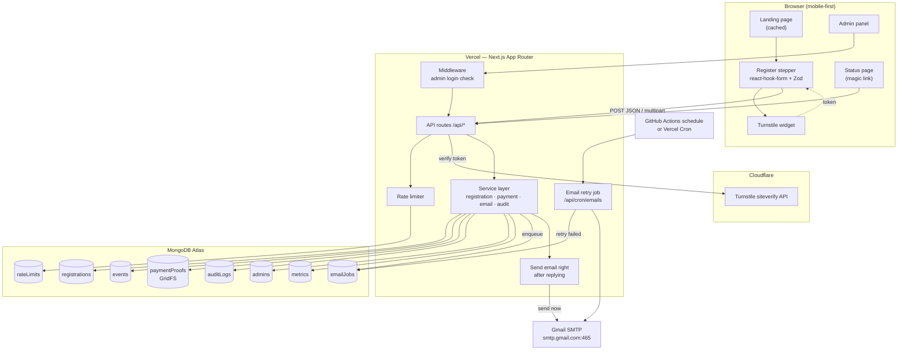
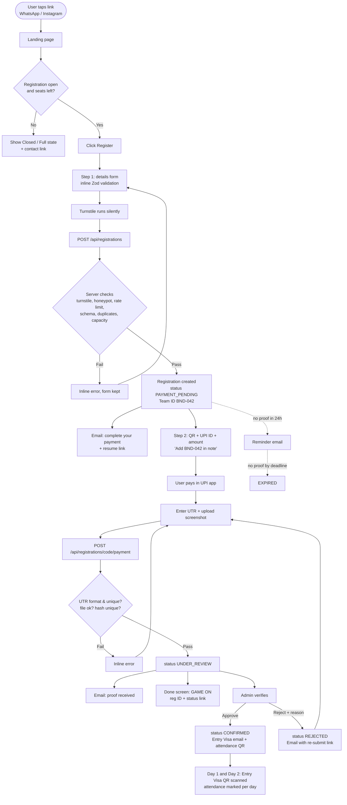
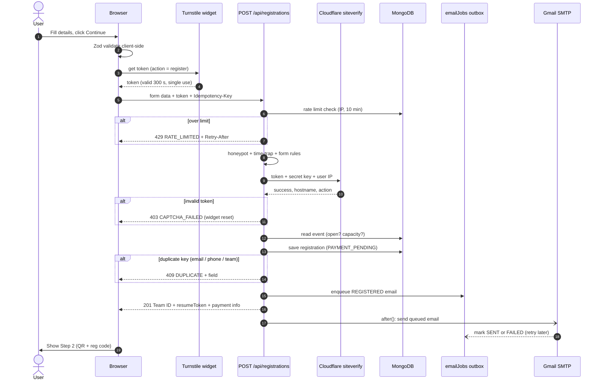
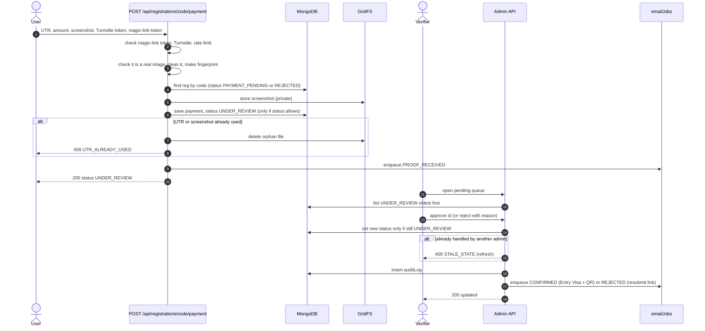
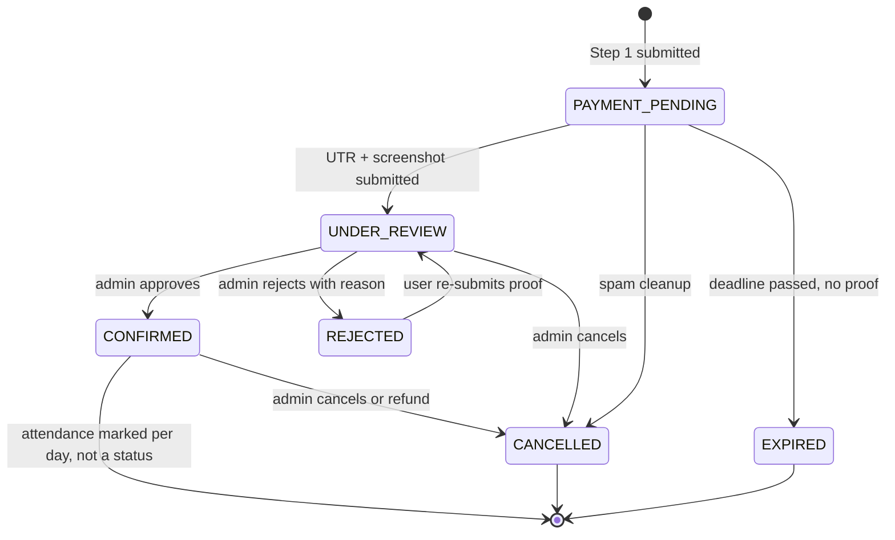
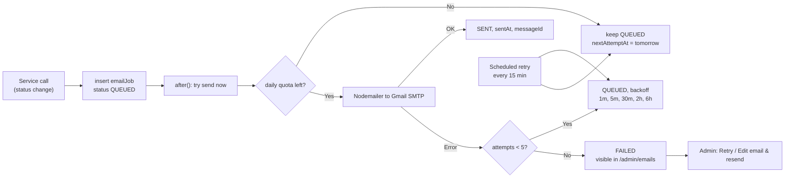
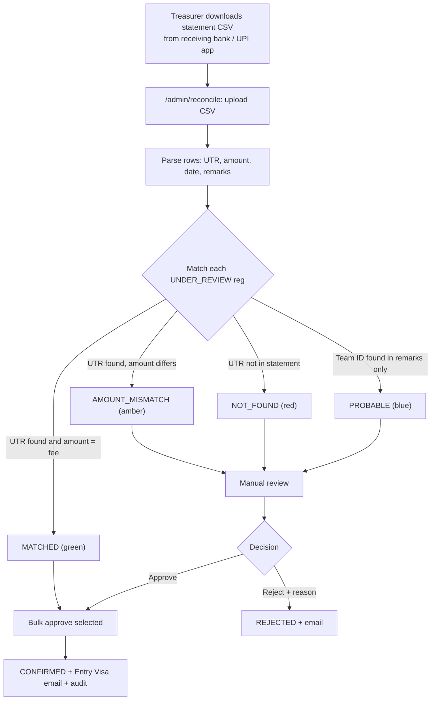
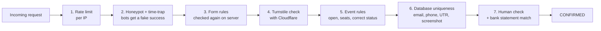

# Event Registration System — Design Pack

> **Theme:** Alice in Borderland · **Stack:** Next.js (App Router) · MongoDB Atlas · Nodemailer + Gmail SMTP · Cloudflare Turnstile · Fixed UPI QR
> **Deliverables in this doc:** Research → PRD → HLD → Workflow & HLD diagrams → LLD → Admin panel & KPIs → Launch checklist
> **Status:** Draft v1 · UI specifics pending (landing layout below is structure-only)

| Item | Decision |
|---|---|
| Expected scale | 200–1,000 registrations, peak ~50 submissions/hour right after the link is shared |
| Payment | Fixed UPI QR (no merchant/PG). Proof = **UTR + screenshot**, verified by a human in the admin panel, helped by bank-statement CSV auto-matching |
| Bot protection | Cloudflare Turnstile (Managed mode) + honeypot + time-trap + per-IP rate limit + server-side Zod validation |
| Email | Nodemailer via Gmail SMTP (App Password), sent through an **outbox collection** with retries |
| Hosting | Vercel (Next.js) + MongoDB Atlas (M0/M10) |
| Team ID | Every team gets a **BND** ID like `BND-042` (running number, same style as Recruitments) — §2.10 |
| Entry & attendance | **Entry Visa** with an attendance QR, scanned on Day 1 and Day 2 — §2.10 |
| Registration flow | **2-step stepper**: (1) details → server creates a registration ID, (2) pay with the ID in the UPI note → submit UTR + screenshot |

---

## Table of Contents

1. [Research: How Similar Sites Do It](#1-research-how-similar-sites-do-it)
2. [PRD — Product Requirements](#2-prd--product-requirements-document)
3. [HLD — High-Level Design](#3-hld--high-level-design)
4. [Workflow Diagrams](#4-workflow-diagrams)
5. [LLD — Low-Level Design](#5-lld--low-level-design)
6. [Admin Panel & KPIs](#6-admin-panel--kpis)
7. [Edge Cases & Error Handling](#7-edge-cases--error-handling)
8. [Build Plan — Step by Step](#8-build-plan--step-by-step)
9. [Testing, Launch Checklist & Open Questions](#9-testing-launch-checklist--open-questions)
10. [Glossary (for newcomers)](#10-glossary-for-newcomers)

> **New to this?** Read §2 (what we're building), look at the diagrams in §4, then follow §8 step by step. Unfamiliar words are explained in §10.

---

## 1. Research: How Similar Sites Do It

### 1.1 Patterns seen on event/fest registration platforms

Looked at how college-fest and hackathon platforms (Unstop, Devfolio, Konfhub/Townscript-style ticketing, Google-Form-based fest registrations, open-source fest templates on GitHub) and general event-form guidance structure their registration.

| Pattern | What they do | What we take from it |
|---|---|---|
| **Short first step** | Ask only identity + contact first; everything else later or optional | Step 1 has ~7 fields. Payment is a separate step |
| **Registration ID early** | Platforms give you an ID/ticket before or right after payment | We create the **BND Team ID** after Step 1 and ask the user to put it in the UPI note → makes manual matching easy |
| **Inline validation** | Real-time feedback on email/phone format, errors shown next to the field | `react-hook-form` + shared **Zod** schema (same rules on client and server) |
| **Consent checkbox** | Terms/refund policy/privacy consent is mandatory | Required checkbox with links to rules + refund policy |
| **Only ask what you'll use** | Forms that ask for everything get abandoned | No gender/DOB/address unless the event actually needs it |
| **Manual UPI verification (fest sites)** | Show QR → collect UTR + screenshot → organiser checks bank app | Same, but we add **UTR uniqueness**, **screenshot hash de-dupe**, and **CSV reconciliation** so it doesn't turn into a spreadsheet nightmare |
| **Status visibility** | Users can check "pending / confirmed" without mailing organisers | Magic-link status page (`/r/[code]?t=…`) — no user accounts needed |
| **Ticket/QR on confirmation** | Confirmation mail carries a QR used at the gate | **Entry Visa** with a signed attendance QR, scanned by volunteers on Day 1 and Day 2 (§2.10) |

### 1.2 Registration form — final field list

**Step 1 — Player details**

| # | Field | Type | Required | Validation rule | Error message (shown inline) |
|---|---|---|---|---|---|
| 1 | Full name | text | ✅ | 2–60 chars, letters/spaces/`.'-` only, trimmed, collapse double spaces | "Enter your full name (letters only)" |
| 2 | Email | email | ✅ | RFC-ish regex + lowercase + trim; block disposable domains (small denylist) | "Enter a valid email — your Entry Visa will be sent here" |
| 3 | Phone (WhatsApp) | tel | ✅ | Indian mobile: `^[6-9]\d{9}$` after stripping `+91`, spaces, `-` | "Enter a 10-digit Indian mobile number" |
| 4 | College / Institution | combobox | ✅ | Pick from list **or** "Other" → free text 3–100 chars | "Select your college" |
| 5 | Register / Roll number | text | ✅ | 4–20 chars, `^[A-Za-z0-9/-]+$`, uppercased | "Enter your roll number as on your ID card" |
| 6 | Year of study | select | ✅ | enum: 1, 2, 3, 4, 5, PG, Other | "Select your year" |
| 7 | Department / Branch | text | ⬜ | ≤ 60 chars | — |
| 8 | Team name | text | only if `event.teamSize.max > 1` | 3–30 chars, unique per event (case-insensitive) | "Team name already taken" |
| 9 | Team members | repeatable group (name, email, phone) | only if team event | count within `[teamSize.min-1, teamSize.max-1]`; emails unique within team and not equal to leader | "Member 2 email is same as yours" |
| 10 | How did you hear about us? | select | ⬜ | enum (Instagram, WhatsApp, Friend, Poster, Other) | — (feeds a KPI) |
| 11 | Consent | checkbox | ✅ | must be `true` | "Accept the rules & refund policy to continue" |
| — | Honeypot `website` | hidden text | — | must be empty | silent reject |
| — | Turnstile token | hidden | ✅ | verified server-side | "Verification failed, please retry" |

**Step 2 — Payment proof**

| # | Field | Type | Required | Validation rule | Error message |
|---|---|---|---|---|---|
| 1 | UPI Transaction ID / UTR | text | ✅ | exactly 12 digits `^\d{12}$` (UPI UTR/RRN), unique across all registrations | "UTR must be the 12-digit number from your payment app" / "This UTR is already used" |
| 2 | Amount paid | number | ✅ | must equal `event.fee` (prefilled, read-only display + confirm) | "Amount must be ₹{fee}" |
| 3 | Paid from UPI ID / name | text | ⬜ | ≤ 60 chars | — (helps admin match) |
| 4 | Payment screenshot | file | ✅ | jpg/png/webp, ≤ 5 MB raw (compressed client-side to ≤ 1 MB), magic-byte checked server-side | "Upload a JPG/PNG screenshot under 5 MB" |
| — | Turnstile token | hidden | ✅ | verified server-side | — |

> **Help text under UTR field:** "GPay → payment → *UPI transaction ID* · PhonePe → *UTR* (not the T-number) · Paytm → *UPI Ref No.*" — this single line kills most wrong-UTR submissions.

### 1.3 Validation & error-handling rules we follow

1. **Write the rules once, use them twice.** The same rules (Zod) run in the form *and* on the server. The server never trusts the browser.
2. **Check when the user leaves a field**, not while they're still typing the first time — no red text too early.
3. **Clean the input first:** trim spaces, lowercase email, remove `+91`/spaces from phone, uppercase roll no.
4. **Show errors next to the field**, plus a short summary at the top on submit, and jump to the first wrong field.
5. **Server errors point to the field** too (e.g. "email: already registered"), so the form shows them in the right place.
6. **Never clear the form on error.** Keep a draft in the browser so a refresh doesn't wipe it.
7. **Disable the submit button + show a spinner** while sending, so double-clicks don't create two registrations.
8. **Human wording, no technical codes** in the UI ("This email is already registered — check your inbox for the status link").

---

## 2. PRD — Product Requirements Document

### 2.1 Problem statement

The club needs a themed website where students can discover the event, register, pay the entry fee via a fixed UPI QR, and receive confirmation — while organisers verify payments and manage participants from an admin panel. Today this is done with Google Forms + manual WhatsApp follow-ups, which leads to lost payments, duplicate entries, and no single source of truth.

### 2.2 Goals & non-goals

| Goals | Non-goals (v1) |
|---|---|
| G1. A user can go from link → confirmed registration in < 3 minutes of their own time | Payment gateway / auto-captured payments |
| G2. Zero lost payments: every UTR is traceable to exactly one registration | Participant login/accounts (magic links instead) |
| G3. Admin verifies a payment in < 30 seconds per entry | Multi-event SaaS (schema is event-scoped so it's possible later) |
| G4. Bot/spam submissions blocked without hurting real users | Mobile app |
| G5. Organisers see live KPIs without exporting to Excel | Refund automation |

### 2.3 Personas

| Persona | Needs |
|---|---|
| **Participant** (student, mobile-first, often on college Wi-Fi/4G) | Quick form, clear fee & QR, proof that payment was received, Entry Visa (QR) for entry |
| **Verifier** (club member, 3–5 people) | Queue of pending payments, screenshot + UTR side-by-side, one-click approve/reject |
| **Organiser / Super-admin** | KPIs, edit event settings (fee, deadline, capacity, QR), export, manage admins |
| **Gate volunteer** (event day) | Scan QR → see name/status → mark checked-in |

### 2.4 User stories

| ID | As a… | I want to… | So that… | Priority |
|---|---|---|---|---|
| US-01 | participant | see event details, fee, date and a countdown | I decide to register | P0 |
| US-02 | participant | fill a short form with instant validation | I don't get errors after submitting | P0 |
| US-03 | participant | get a registration ID before paying | I can reference it in my UPI note | P0 |
| US-04 | participant | scan/copy the UPI ID and see the exact amount | I pay correctly | P0 |
| US-05 | participant | submit UTR + screenshot | organisers can verify me | P0 |
| US-06 | participant | receive an email at each status change | I know where I stand | P0 |
| US-07 | participant | resume payment later from an email link | closing the tab doesn't lose my spot | P0 |
| US-08 | participant (rejected) | re-submit a corrected UTR/screenshot via link | I don't have to register again | P1 |
| US-09 | verifier | see the pending queue oldest-first with screenshot preview | I work fast | P0 |
| US-10 | verifier | upload the bank statement CSV and see auto-matched UTRs | I bulk-approve safely | P1 |
| US-11 | organiser | see KPIs (funnel, revenue, pending, colleges) | I track progress | P0 |
| US-12 | organiser | CRUD registrations and export CSV | I fix mistakes and share lists | P0 |
| US-13 | organiser | change fee/deadline/capacity/QR without redeploy | ops don't need a developer | P0 |
| US-14 | volunteer | scan the Entry Visa QR and mark attendance | entry is fast and fraud-proof | P0 |
| US-15 | organiser | see who did what (audit log) | disputes can be resolved | P1 |

### 2.5 Functional requirements

| ID | Requirement |
|---|---|
| FR-01 | Landing page shows event data from the database (cached for speed, refreshed automatically when an admin changes settings) |
| FR-02 | Registration opens/closes automatically on `registrationOpensAt` / `registrationClosesAt`; admin can force-close |
| FR-03 | Capacity: new registrations blocked when `confirmed + underReview ≥ capacity`; show "Registrations full" state |
| FR-04 | Step 1 creates a registration in `PAYMENT_PENDING` and returns `teamId` + signed resume token |
| FR-05 | Step 2 accepts UTR + screenshot → status `UNDER_REVIEW` |
| FR-06 | Uniqueness: one registration per email per event, per phone per event, per UTR globally, per screenshot hash |
| FR-07 | Every request with a form passes Turnstile server verification (hostname + action checked) |
| FR-08 | Rate limit: 5 registration attempts / IP / 10 min, 20 / IP / day; login 5 / IP / 15 min |
| FR-09 | Emails on: registered (pay-pending), proof received, confirmed (with Entry Visa + attendance QR), rejected (with re-submit link), reminder for unpaid after 24 h |
| FR-10 | Admin: login, RBAC (SUPER_ADMIN, VERIFIER, VOLUNTEER), list/search/filter/sort, view, edit, approve, reject (reason required), soft-delete, restore, export CSV, bulk actions, settings, audit log |
| FR-11 | Status transitions follow the state machine (§4.4); illegal transitions return 409 |
| FR-12 | Payment reconciliation: upload CSV → match on UTR (+ amount) → mark `matched` → bulk-approve |
| FR-13 | Public status page via magic link shows current status and next action |
| FR-14 | Attendance: scanning the Entry Visa QR opens `/admin/attendance/[teamId]`; volunteer marks Day 1 / Day 2 and ticks players present; duplicate-scan warning (details in §2.10) |

### 2.6 Non-functional requirements

| Area | Target |
|---|---|
| Performance | Landing LCP < 2.5 s on 4G; API p95 < 800 ms (excluding upload) |
| Availability | Rides on Vercel + Atlas; no single custom server |
| Security | OWASP Top-10 basics, httpOnly admin session, CSP, no PII in logs, private payment screenshots |
| Privacy (India DPDP Act 2023) | Explicit consent, collect minimum data, screenshots deleted 30 days after event, contact for deletion requests |
| Accessibility | WCAG 2.1 AA: labels, focus states, contrast even with dark theme, errors announced via `aria-live` |
| Mobile | Designed mobile-first (most traffic comes from WhatsApp/Instagram links) |
| Observability | Structured logs (requestId), `emailJobs` + `auditLogs` collections, Vercel logs |

### 2.7 Success metrics

| Metric | Target |
|---|---|
| Form completion rate (Step 1 started → Step 1 submitted) | ≥ 70 % |
| Payment completion rate (Step 1 → Step 2 submitted) | ≥ 80 % |
| Median verification time (UNDER_REVIEW → CONFIRMED) | < 12 h |
| Spam registrations reaching DB | < 1 % |
| Email delivery failures after retries | 0 |

### 2.8 Assumptions, risks & mitigations

| Risk | Impact | Mitigation |
|---|---|---|
| Fake screenshots | Unpaid entry | Screenshot is only secondary proof — **UTR must match the bank statement** before approve (CSV reconciliation) |
| Same payment reused by two people | Revenue loss | Unique index on `payment.utr` + SHA-256 hash of the screenshot |
| Gmail daily limit (≈500 recipients/day on a personal account, ≈2,000 on Workspace) | Emails stop mid-launch | Outbox with retries, daily counter, admin digest instead of per-registration admin mails, use a Workspace account if available |
| Viral traffic spike | Slow site | Landing is static/ISR; API is tiny; Atlas connection reuse |
| User typos email | Never receives Entry Visa | "Confirm email" shown on review screen + status page lookup + admin can edit & resend |
| Wrong amount paid | Disputes | Amount field + admin sees amount on statement; reject reason "Amount mismatch" template |

### 2.9 Milestones

| Week | Deliverable |
|---|---|
| W1 | DB schema, Zod schemas, Step 1 + Step 2 APIs, Turnstile, rate limit |
| W2 | Landing (themed UI), stepper form, emails via outbox |
| W3 | Admin panel: auth, list/detail, approve/reject, KPIs, export |
| W4 | CSV reconciliation, Entry Visa + attendance, load test, launch checklist |

### 2.10 Team ID (`BND`), Entry Visa & Attendance QR

Two things carried over from how Recruitments worked: every team gets a **BND Team ID**, and every confirmed team gets an **Entry Visa** with an **attendance QR** that's scanned on both days.

#### A. Team ID — `BND-###`

| Item | Decision |
|---|---|
| Format | `BND-` + running number, 3 digits: `BND-001`, `BND-002` … `BND-999` (goes to 4 digits after that). Prefix and digit count can be changed from admin settings, to match the exact Recruitments format |
| One per | **Team** (not per player). Players are shown as `BND-042 · P1`, `P2`… where needed |
| When it's given | At the end of **Step 1** (team details saved), so the team can type it in the UPI payment note |
| How it's made | A `counters` collection keeps the last number used. Each new team takes the next number in **one database operation** (+1 and read back together), so two teams submitting at the same second never get the same ID |
| Gaps | Numbers are **never reused**. If a team expires, is cancelled or is deleted as spam, its number is simply skipped |
| Where it shows | Success screen, every email subject, status page, Entry Visa, UPI note, admin table & search, CSV export, attendance screen, (later) the Game Day leaderboard |
| Safety | Running numbers are easy to guess, so the ID **alone never opens anything**. Status and Visa pages also need the signed token from the email; the attendance QR only works for logged-in volunteers |

#### B. Entry Visa

The team's digital pass, styled as the **Player Visa** from the event theme.

| Item | Decision |
|---|---|
| When it's issued | The moment an admin **confirms the payment** (status CONFIRMED). Before that, the status page says *"Visa pending issuance"* |
| How the team gets it | In the confirmation email (as an image + a link) and on the Visa page `/visa/BND-042?t=…`. It can be saved to the phone's gallery or downloaded as PDF, so it works without internet at the gate |
| One visa per | Team (default). *Option for later:* a separate visa + QR per player |
| Status | **VALID** once confirmed · **REVOKED** if the team is cancelled (the QR stops working) |

**What's printed on the Visa:**

| Field | Example |
|---|---|
| Team ID | BND-042 |
| Team name & college | Null Pointers · SRM IST |
| Players | 4 names, leader marked |
| Event | Day 1 + Day 2 · [dates] · 09:00 reporting · [venue] |
| Status | VALID |
| Starting Visa Points | 03 (same as the Game Day rule) |
| **Attendance QR** | Scanned at the desk each day |
| Day stamps | "DAY 1 ✓ 09:12", "DAY 2 ✓ 08:55" appear once attendance is marked |

#### C. Attendance QR — how it works

- The QR holds a **signed link** like `/admin/attendance/BND-042?sig=…`. The signature (made with `LINK_SECRET`) means nobody can make a fake QR for another team, and the QR contains no personal data.
- The link only opens for a **logged-in volunteer**. If anyone else scans it, they see nothing useful.

**At the registration desk (each day):**

1. The volunteer opens the **Attendance** page and picks **Day 1** or **Day 2** (defaults to today).
2. They scan the team's QR with the phone camera.
3. The screen shows the team card: Team ID, team name, status (**green** if CONFIRMED, **red** otherwise), and the list of players with checkboxes, all ticked.
4. The volunteer checks college IDs, unticks anyone who is absent, and taps **Mark present**.
5. The system saves the day, time, the volunteer's name and which players were present. The team's Visa gets that day's stamp.
6. If the same QR is scanned again that day, it shows *"Already marked at 09:12 by Riya"*. The volunteer can still add a player who arrives late.

**Fallbacks:** no QR or dead phone → search by Team ID or the leader's phone number. Desk has no internet → use the exported team list (CSV) and enter it later.

**Link to Game Day:** Day 2 attendance is the event's *"Check-in & Visa issuance"* slot. Every team present starts with 3 Visa Points. Game scoring itself is outside this registration system.

**Data saved on the team's registration:**

| Field | Meaning |
|---|---|
| `teamId` | `BND-042` |
| `visa.issuedAt`, `visa.status` | When the Visa was issued; VALID / REVOKED |
| `attendance` | One entry per day: day (1 or 2), time, volunteer, players present |

#### D. New user stories & requirements

| ID | As a… | I want to… | So that… | Priority |
|---|---|---|---|---|
| US-16 | team | get a BND Team ID right after Step 1 | I can use it in the UPI note and when contacting the club | P0 |
| US-17 | team | receive an Entry Visa with a QR once confirmed | entry on both days is quick | P0 |
| US-18 | volunteer | scan a QR and mark which players are present for Day 1 or Day 2 | attendance takes under 10 seconds per team | P0 |
| US-19 | organiser | see Day 1 and Day 2 attendance and no-shows | I know who actually came | P1 |

| ID | Requirement |
|---|---|
| FR-15 | Every team gets a unique, never-reused Team ID `BND-###` from an atomic counter at Step 1 |
| FR-16 | An Entry Visa (page + email image + PDF) is issued automatically when the status becomes CONFIRMED, and shows REVOKED if the team is cancelled |
| FR-17 | The Visa carries a signed attendance QR that only opens for logged-in volunteers |
| FR-18 | Attendance is saved **per day** (Day 1 and Day 2) with the time, the volunteer and the players present. A second scan on the same day warns and allows editing |
| FR-19 | Admin panel shows attendance KPIs per day and a list of no-shows, and the CSV export includes attendance columns |

---

## 3. HLD — High-Level Design

### 3.1 Architecture diagram

### 3.2 Components

| Part | What it does | Built with |
|---|---|---|
| **Landing page** | Event info, theme, countdown, fee, FAQ, Register button | Next.js page, cached for speed |
| **Register page (stepper)** | Step 1 details → Step 2 payment → Done | react-hook-form + Zod + Turnstile widget |
| **Status page** | Shows "pending / confirmed / rejected" and what to do next | Opened from a magic link in the email |
| **API routes** | Receive form data, run checks, call the services | Next.js route handlers |
| **Services** | The real logic: create registration, save payment, approve, reject, emails | Plain TypeScript functions in `lib/services/` |
| **Turnstile check** | Confirms the user is human | Cloudflare siteverify API |
| **Rate limiter** | Stops too many tries from one IP | A small counter collection in MongoDB |
| **File storage** | Keeps payment screenshots private | MongoDB GridFS (no extra service needed) |
| **Email queue** | Sends emails reliably and retries failures | `emailJobs` collection + Nodemailer + Gmail |
| **Admin panel** | Verify payments, manage entries, KPIs, settings | Next.js pages, table + charts |
| **Admin login** | Keeps admin pages private, with roles | Hashed passwords + signed login cookie |
| **Audit log** | Records who changed what | `auditLogs` collection |

### 3.3 Key design decisions (and why)

| # | Decision | Why | Alternative rejected |
|---|---|---|---|
| D1 | **Two-step registration** (details first, payment second) | Gives a `teamId` to put in the UPI note → trivial matching; captures abandoned-payment leads for reminder emails; resume link if user closes tab | Single long form — loses everything if payment app switch kills the tab (very common on Android) |
| D2 | **Cloudflare Turnstile** (Managed mode) | Free, privacy-friendly, mostly invisible, no Google dependency; token is single-use & valid 5 min | reCAPTCHA v3 — score tuning, Google tracking concerns |
| D3 | **UTR unique index + screenshot hash** | Prevents one payment being reused across registrations — the real fraud vector with a fixed QR | Trusting screenshots |
| D4 | **Bank CSV reconciliation** | Screenshots can be edited; the bank statement can't. Auto-match turns 200 manual checks into 1 bulk approve | Checking each UTR by scrolling the UPI app |
| D5 | **Email outbox** instead of fire-and-forget | Gmail SMTP fails/throttles; a registration must never fail because email failed, and no email should be silently lost | Sending inline and ignoring errors |
| D6 | **GridFS for screenshots** | Private by default, one vendor, fine at < 5k files after compressing to ~200 KB | Public Cloudinary URLs leak payment info |
| D7 | **Magic links, no participant accounts** | Less friction, no password resets; HMAC-signed, scoped to one registration | NextAuth for participants |
| D8 | **Event config in DB** (`events` doc) | Change fee/deadline/QR/capacity from admin without redeploy | Hard-coded constants / `.env` |
| D9 | **Soft delete** | Deleted spam can be restored and still counts for duplicate checks | Hard delete |

### 3.4 Page map

| Route | Type | Access | Purpose |
|---|---|---|---|
| `/` | Server (cached) | public | Landing page |
| `/register` | Client stepper | public | Step 1 (details) → Step 2 (pay) → Done |
| `/register/pay/[code]` | Server + client | magic token | Resume payment (from email) |
| `/r/[code]` | Server | magic token | Registration status / re-submit proof |
| `/visa/[teamId]` | Server | magic token | Entry Visa with attendance QR (download as image/PDF) |
| `/rules`, `/refund-policy`, `/privacy` | Static | public | Linked from consent checkbox |
| `/admin/login` | Client | public | Admin login |
| `/admin` | Server | any admin | KPI dashboard |
| `/admin/registrations` | Server + client table | VERIFIER+ | List / filter / bulk actions |
| `/admin/registrations/[id]` | Server | VERIFIER+ | Detail, screenshot, approve/reject, edit, timeline |
| `/admin/reconcile` | Client | VERIFIER+ | Upload bank CSV, auto-match |
| `/admin/attendance` & `/admin/attendance/[teamId]` | Client | VOLUNTEER+ | QR scan & Day 1 / Day 2 attendance |
| `/admin/emails` | Server | SUPER_ADMIN | Email outbox, retry failed |
| `/admin/settings` | Client | SUPER_ADMIN | Event settings, QR upload, admins, audit log |

### 3.5 Landing page layout (structure — visuals come with tomorrow's UI)

Alice in Borderland motifs that map naturally onto sections: **playing cards / suits** (♠ physical, ♣ teamwork, ♦ intellect, ♥ psychological), **"Visa" countdown**, deserted-city neon, **"GAME CLEAR" / "GAME OVER"** states.

| # | Section | Content | Theme hook |
|---|---|---|---|
| 1 | Nav | Logo, About, Games, Timeline, FAQ, **Register** (sticky on mobile) | — |
| 2 | Hero | Event name, tagline, date · venue, **"Enter the Borderland"** CTA, countdown to deadline | Countdown styled as "Your visa expires in 03d 12h" |
| 3 | About | 2–3 lines on what the event is | Rules card flip |
| 4 | Games / Tracks | Each round/track as a playing card (suit + difficulty number) | Card suit = category, card number = difficulty |
| 5 | Timeline | Registration open → close → event day → results | "Stages" |
| 6 | Entry fee & prizes | Fee in large type, what's included, prize pool | "Entry cost to the game" |
| 7 | How to register | 3 steps: Fill → Pay via UPI → Get your Entry Visa | Sets expectations for manual verification |
| 8 | FAQ | Payment verification time, refund policy, team rules, contact | Accordion |
| 9 | Footer | Club socials, contact email/phone, rules/privacy links | — |

States driven by `events` doc: **Not open yet** (countdown to open), **Open**, **Almost full** (> 90 % capacity badge), **Closed / Full** ("GAME OVER — registrations closed").
Performance: hero art as optimised WebP/AVIF via `next/image`, animations CSS-only or lazy-loaded, `prefers-reduced-motion` respected.

### 3.6 Security overview

| Area | What we do |
|---|---|
| Connection | HTTPS everywhere (Vercel gives it free); only allow scripts from our site + Cloudflare Turnstile |
| Bots | Turnstile + hidden honeypot field + "too fast" check + rate limits |
| Input | Every field re-checked on the server; unknown fields ignored |
| Files | Size limit, check it's really an image, re-save it clean, keep it private |
| Admin login | Hashed passwords, secure cookie, 8-hour session, lock after 5 wrong tries, roles checked on the server |
| Output | Escape user text in emails; make CSV exports safe for Excel |
| Secrets | Only in Vercel environment variables; Gmail uses an **App Password**, never the real password |
| Privacy | Ask for consent, collect only what's needed, never log personal data, delete screenshots 30 days after the event |

### 3.7 Will it handle the load?

- Yes for this size. The landing page is cached, and the API only does two small saves per user.
- **Email is the real limit:** 1,000 registrations × ~3 emails = ~3,000 emails, but a personal Gmail sends only ~500/day. The email queue spreads them out automatically, and admins get one hourly summary instead of one mail per registration. A Google Workspace account (~2,000/day) helps a lot.
- Reuse one database connection across requests (MongoDB Atlas free tier limits the number of connections).

---

## 4. Workflow Diagrams

### 4.1 End-to-end user journey

### 4.2 Sequence — Step 1 submit (create registration)

### 4.3 Sequence — Step 2 payment proof & admin verification

### 4.4 Registration state machine

| From → To | Who | Side-effects |
|---|---|---|
| — → PAYMENT_PENDING | participant | email `REGISTERED` |
| PAYMENT_PENDING / REJECTED → UNDER_REVIEW | participant | store proof, email `PROOF_RECEIVED`, admin digest |
| UNDER_REVIEW → CONFIRMED | VERIFIER+ | `verifiedBy/At`, **Entry Visa issued**, email `CONFIRMED` with Visa + attendance QR, audit |
| UNDER_REVIEW → REJECTED | VERIFIER+ | reason required, `rejectCount++`, email `REJECTED`, audit |
| Attendance Day 1 / Day 2 (not a status change) | VOLUNTEER+ | adds an `attendance` entry (day, time, volunteer, players present), stamps the Visa, audit |
| any → CANCELLED | SUPER_ADMIN | reason, email `CANCELLED` (optional), audit |
| PAYMENT_PENDING → EXPIRED | system (cron) | email `EXPIRED` (optional) |

### 4.5 Email workflow (outbox)

### 4.6 Admin verification + reconciliation workflow

---

## 5. LLD — Low-Level Design

> This section explains **how to build each piece**, in plain steps. It is not code — hand these steps to your AI coding tool (Cursor / Claude / v0 etc.) one piece at a time, as described in [§8 Build Plan](#8-build-plan--step-by-step).

### 5.1 Packages you'll use

| Package | What it's for |
|---|---|
| `next` (App Router) | The website + the backend API routes, in one project |
| `mongodb` (official driver) or `mongoose` | Talking to the database |
| `zod` | Writing the form rules once (e.g. "phone = 10 digits") and using them on both the form and the server |
| `react-hook-form` + `@hookform/resolvers` | Handling the form inputs and showing errors under each field |
| `@marsidev/react-turnstile` | Drops the Cloudflare Turnstile box into the form |
| `nodemailer` | Sending emails through Gmail |
| `browser-image-compression` | Shrinks the payment screenshot on the user's phone before upload |
| `sharp` + `file-type` | On the server: checks the upload is really an image and cleans/re-saves it |
| `bcryptjs` | Stores admin passwords safely (never store plain passwords) |
| `jose` | Creates the admin login session (signed cookie) |
| `qrcode` | Makes the attendance QR on the Entry Visa |
| `papaparse` | Reads the bank statement CSV in the admin panel |
| `recharts` | Charts on the admin dashboard |
| `@tanstack/react-table` | The admin registrations table (sorting, filtering, selecting rows) |

### 5.2 Project folders (what goes where)

| Folder | What lives there |
|---|---|
| `app/` (public pages) | Landing page, `/register`, `/register/pay/[code]`, `/r/[code]` status page, rules/refund/privacy pages |
| `app/admin/` | All admin screens: login, dashboard, registrations list, registration detail, reconcile, attendance, emails, settings |
| `app/api/` | Backend endpoints (listed in §5.5) |
| `lib/validation/` | The Zod form rules — **shared by frontend and backend** |
| `lib/services/` | The actual logic: create registration, submit payment, approve, reject, send email, stats |
| `lib/security/` | Turnstile check, rate limiter, magic-link tokens |
| `lib/email/templates/` | One file per email type |
| `components/` | Reusable UI pieces (form steps, cards, admin table, themed buttons) |
| `scripts/` | One-time scripts: create database indexes, create the first admin account |
| `middleware.ts` (called `proxy.ts` in Next.js 16) | Blocks anyone not logged in from opening `/admin/*` |

> Rule of thumb: **pages and API routes stay thin** — they just call a function in `lib/services/`. That keeps the logic in one place and easy to test.

### 5.3 Settings & secrets (`.env` file)

| Name | What it is | Where you get it |
|---|---|---|
| `MONGODB_URI` | Database connection string | MongoDB Atlas → Connect |
| `NEXT_PUBLIC_TURNSTILE_SITE_KEY` | Public key for the Turnstile box | Cloudflare dashboard → Turnstile → Add widget |
| `TURNSTILE_SECRET_KEY` | Private key for checking Turnstile on the server | Same place (keep secret!) |
| `SMTP_USER` | Gmail address that sends the mails | Club Gmail account |
| `SMTP_APP_PASSWORD` | 16-character Gmail **App Password** (not the real password) | Google Account → Security → turn on 2-Step Verification → App passwords |
| `MAIL_FROM` | Sender name shown in inbox, e.g. *Borderland Games* | You decide |
| `EMAIL_DAILY_CAP` | Max emails per day, e.g. 450 | Keep under Gmail's limit (~500/day personal, ~2,000/day Workspace) |
| `ADMIN_NOTIFY_EMAIL` | Where the "N payments waiting" digest goes | Core team email |
| `SESSION_SECRET` | Random long string to sign admin login cookies | Generate any 32+ character random string |
| `LINK_SECRET` | Random long string to sign magic links & attendance QRs | Same |
| `CRON_SECRET` | Password for the scheduled "retry emails" job | Same |
| `APP_URL` | Your live website URL | After deploying on Vercel |

> **Testing tip:** Cloudflare gives test Turnstile keys that always pass — site key `1x00000000000000000000AA`, secret `1x0000000000000000000000000000000AA`. Use them locally, switch to real keys in production.

> Things like **fee, dates, capacity, UPI ID, QR image** are *not* in `.env` — they live in the database (`events` collection) so an admin can change them from the settings page without redeploying.

### 5.4 Database design (MongoDB)

#### Collections at a glance

| Collection | One document = | Key fields |
|---|---|---|
| `events` | The event and all its settings | name, venue, event date, registration open/close dates, force-close switch, capacity, fee, team size (min/max), UPI ID, payee name, QR image, college list, FAQ, contact |
| `registrations` | One participant (or team leader) | see table below |
| `admins` | One admin user | email, name, hashed password, role (SUPER_ADMIN / VERIFIER / VOLUNTEER), active, failed login count, locked until |
| `emailJobs` | One email to be sent | to, template name, linked registration, status (QUEUED / SENDING / SENT / FAILED), attempts, next try time, last error |
| `auditLogs` | One admin action | who, what action, which registration, before/after values, time |
| `rateLimits` | A request counter for one IP in one time window | key, count, auto-delete time |
| `metrics` | A daily counter | e.g. emails sent today, landing page views today, form starts today |
| `reconcileBatches` | One uploaded bank statement | who uploaded, file name, matched / mismatched / not-found counts |
| GridFS bucket `proofs` | One payment screenshot or QR image | stored privately inside MongoDB |

#### `registrations` fields

| Group | Fields | Notes |
|---|---|---|
| Identity | `teamId` | **BND Team ID** like `BND-042` — running number from the `counters` collection, never reused (§2.10) |
| Entry Visa | `visa.issuedAt`, `visa.status` | Issued on CONFIRMED; VALID / REVOKED |
| Attendance | `attendance[]` | One entry per day: day (1/2), time, volunteer, players present |
| Status | `status` | PAYMENT_PENDING → UNDER_REVIEW → CONFIRMED / REJECTED (also CANCELLED, EXPIRED); attendance is tracked separately — see §4.4 |
| Participant | `fullName`, `email` (lowercase), `phone` (10 digits), `college`, `rollNo` (uppercase), `year`, `department`, `source` (how they heard) | Cleaned before saving |
| Team (optional) | `team.name`, `team.members[]` (name, email, phone) | Only if team event |
| Payment | `payment.utr`, `payment.amount`, `payment.payerUpi`, `payment.screenshotId`, `payment.screenshotHash`, `payment.submittedAt`, `payment.reconcileResult` | Filled in Step 2 |
| Payment history | list of earlier UTR/screenshots + reject reason | So nothing is lost when a user re-submits |
| Review | `verifiedAt/By`, `rejectedAt/By`, `rejectReason`, `rejectCount`, `checkedInAt/By`, `cancelReason`, `adminNotes` | Filled by admins |
| Safety | `idempotencyKey`, `ipHash` (hashed, not the raw IP), `userAgent`, `consentAt` | Anti-duplicate & audit |
| Housekeeping | `createdAt`, `updatedAt`, `deletedAt` (soft delete), `reminderSentAt` | |

#### Uniqueness rules (database indexes)

Create these once with a script. They make MongoDB itself **refuse** duplicates — even if two requests arrive at the same millisecond.

| Rule | Stops |
|---|---|
| `teamId` is unique | Two people getting the same ID |
| `email` unique per event | Same person registering twice |
| `phone` unique per event | Same person with a second email |
| `rollNo + college` unique per event | Same student with a different email/phone |
| `payment.utr` unique (only when filled) | **One payment being reused for two registrations** |
| `payment.screenshotHash` unique (only when filled) | The exact same screenshot being uploaded twice |
| `team.name` unique per event (only when filled) | Two teams with the same name |
| `idempotencyKey` unique | Double-click creating two registrations |
| `status + createdAt` (normal index) | Makes the admin queue and dashboard fast |
| `rateLimits.expiresAt` (auto-delete index) | Old rate-limit counters cleaning themselves up |

> Deleted (spam) registrations are only **soft-deleted** (hidden, not erased), so they still block the same email/UTR from coming back. A super-admin can restore or permanently delete them.

### 5.5 API endpoints

**Every response has the same shape:** either *ok + data* or *error + code + message (+ which fields are wrong)*. The frontend uses the field list to show the red message under the right input.

#### Public endpoints

| Endpoint | What it does | Main checks | Success result |
|---|---|---|---|
| `GET /api/event` | Gives the landing page event info | — | name, fee, dates, state (UPCOMING / OPEN / FULL / CLOSED), seats "plenty / few / none" (exact count is hidden) |
| `POST /api/registrations` | **Step 1** — creates the registration | rate limit, honeypot, time-trap, form rules, Turnstile, open & not full, duplicates | Team ID, resume link, payment info (UPI ID, amount, QR, note to add) |
| `POST /api/registrations/[code]/payment` | **Step 2** — saves UTR + screenshot | magic-link token, rate limit, Turnstile, UTR format, amount = fee, real image, UTR & screenshot not used before, status allows it | status = UNDER_REVIEW + status link |
| `GET /api/registrations/[code]/status` | Status page data | magic-link token | status, reject reason, can re-submit?, Entry Visa link if confirmed |
| `POST /api/registrations/[code]/resend` | "Email me my link again" | Turnstile, 3 per hour per email | Always says "if this email is registered, we've sent the link" (doesn't reveal who's registered) |

#### Admin endpoints (all need login)

| Endpoint | Who can use | What it does |
|---|---|---|
| `POST /api/admin/auth/login` · `logout` | anyone / admins | Log in (Turnstile + 5 wrong tries = 15-min lock), log out |
| `GET /api/admin/registrations` | Verifier+ | List with filters (status, college, year, date, reconcile result), search (name, email, phone, Team ID, UTR), sorting, pages |
| `POST /api/admin/registrations` | Super-admin | Add a registration manually (e.g. cash payment at desk) |
| `GET / PATCH / DELETE /api/admin/registrations/[id]` | Verifier+ / Super-admin for delete | View, edit details, soft-delete |
| `POST …/[id]/approve` | Verifier+ | Confirm — only works if status is still UNDER_REVIEW |
| `POST …/[id]/reject` | Verifier+ | Reject with a reason: *UTR not found*, *Amount mismatch*, *Unreadable screenshot*, *Duplicate payment*, *Other* |
| `POST …/[id]/cancel` · `restore` | Super-admin | Cancel (refund) or undo a delete |
| `POST …/[id]/attendance` | Volunteer+ | Mark Day 1 / Day 2 attendance with the players present; warns if that day is already marked |
| `GET /api/visa/[teamId]` | Team (magic token) | Entry Visa data + attendance QR (image / PDF download) |
| `POST …/[id]/resend-email` | Verifier+ | Re-send any email to that person |
| `POST /api/admin/registrations/bulk` | Verifier+ | Approve / reject / remind / delete many at once |
| `GET /api/admin/proofs/[fileId]` | Verifier+ | Shows a payment screenshot (never public) |
| `POST /api/admin/reconcile` | Verifier+ | Upload bank statement → auto-match report |
| `GET /api/admin/stats` | All admins | Numbers for the dashboard (§6.2) |
| `GET /api/admin/export` | Super-admin | Download CSV of registrations (with current filters) |
| `GET /api/admin/emails` · `POST …/[id]/retry` | Super-admin | See email queue, retry failed ones |
| `GET / PUT /api/admin/settings` | Super-admin | Change fee, dates, capacity, QR, FAQ, colleges; manage admins |
| `GET /api/admin/audit` | Super-admin | See who did what |
| `/api/cron/emails` · `expire` · `digest` | Scheduler only (needs `CRON_SECRET`) | Retry pending emails · expire unpaid registrations after deadline · send hourly admin digest |

### 5.6 Error messages

| Code | When | What the user sees |
|---|---|---|
| `VALIDATION_ERROR` | A field breaks a rule | Message under that field |
| `CAPTCHA_FAILED` | Turnstile check failed | "Couldn't verify you're human. Please try again." |
| `RATE_LIMITED` | Too many tries | "Too many attempts. Try again in N minutes." |
| `REGISTRATION_CLOSED` | After deadline / force-closed | "Registrations are closed." |
| `EVENT_FULL` | Capacity reached | "All seats are taken." |
| `DUPLICATE_*` | Email / phone / roll no already used | "Already registered — we've emailed your status link." |
| `TEAM_NAME_TAKEN` | Team name exists | "That team name is taken." |
| `INVALID_LINK` | Magic link wrong or expired | "This link is invalid or expired. Request a new one." |
| `UTR_ALREADY_USED` | UTR on another registration | "This UTR is already linked to another registration." |
| `DUPLICATE_SCREENSHOT` | Same image uploaded before | "This screenshot was already submitted." |
| `FILE_INVALID` | Not an image / too big | "Upload a JPG/PNG/WebP image under 2 MB." |
| `AMOUNT_MISMATCH` | Amount ≠ fee | "Amount must be ₹{fee}." |
| `STALE_STATE` | (admin) someone else already handled it | "Already handled by another admin — refresh." |
| `INTERNAL` | Anything unexpected | "Something broke on our side. Your data is safe — try again." |

> Never show raw technical errors (like `E11000 duplicate key`) to users. The server translates them into the codes above.

### 5.7 How each part works

#### A. Form rules (validation)

1. Write all field rules **once** in `lib/validation/` using Zod (field list and rules are in §1.2).
2. The form uses these rules to show errors instantly (after the user leaves a field).
3. The API route runs **the same rules again** — anyone can skip the form and call the API directly, so the server must never trust the browser.
4. Before checking, clean the input: trim spaces, lowercase the email, remove `+91` and spaces from the phone, uppercase the roll number.
5. If the server finds an error, it sends back which field failed, and the form shows it under that field. **The form is never cleared on error.**

#### B. Turnstile (bot check) — setup and flow

1. In the Cloudflare dashboard → Turnstile → **Add widget**, enter your domain(s) (and `localhost` for testing), choose **Managed** mode. You get a site key and a secret key.
2. Put the Turnstile component in each form (register, payment, resend link, admin login). Give each one a different **action name** (`register`, `payment`, `resend`, `admin_login`).
3. When the user passes (usually automatically, no puzzle), the widget gives the form a **token**. Keep the submit button disabled until the token exists.
4. Send the token to the server along with the form.
5. The server sends the token + secret key to Cloudflare's **siteverify** API. Accept only if: success is true, the hostname is your domain, and the action matches that form.
6. If Cloudflare can't be reached, **reject** (fail safe) and ask the user to retry.
7. Tokens expire after **5 minutes** and **work only once**. So after any failed submit, or if the user sat on the page too long, reset the widget to get a fresh token (the form data stays).
8. If the widget fails to load (ad-blocker / bad network), show: "Verification couldn't load — disable blockers or switch network."

#### C. Rate limiting (slowing down spam)

1. Each time someone submits, add +1 to a counter for their IP (store a **hash** of the IP, not the IP itself) for the current time window.
2. If the counter goes over the limit, return "Too many attempts, try again in N minutes".
3. Counters delete themselves automatically after the window ends (MongoDB auto-delete index).
4. Limits: registration 5 per 10 min and 20 per day per IP; payment 5 per 10 min per registration; admin login 5 per 15 min.
5. **Careful:** a whole college hostel can share one IP on Wi-Fi. Keep limits generous and editable from the settings page — Turnstile is the main bot gate, the rate limit is a backup.

#### D. What happens when Step 1 is submitted

1. Browser checks the form rules and gets a Turnstile token.
2. Browser sends the data with an **Idempotency-Key** (a random ID created when the form opened). If the same key comes in twice (double-click, network retry), the server returns the first result instead of making a second registration.
3. Server checks the rate limit.
4. **Honeypot:** there is a hidden field humans can't see. If it's filled, it's a bot — pretend success, save nothing.
5. **Time-trap:** if the form was submitted less than 3 seconds after it opened, it's a bot — reject.
6. Server re-checks all form rules.
7. Server verifies the Turnstile token with Cloudflare.
8. Server checks registrations are open and seats remain (confirmed + under review < capacity).
9. Server creates a `teamId`, saves the registration with status **PAYMENT_PENDING**. If the database says "duplicate", return the matching friendly error (and email the existing person their status link).
10. Server adds a "complete your payment" email to the email queue.
11. Server replies with the Team ID, a resume link and payment details → the page moves to Step 2.
12. The email is sent right after the reply goes out (so the user doesn't wait for Gmail).

#### E. What happens when Step 2 (payment proof) is submitted

1. The page shows: QR image, UPI ID (with copy button), exact amount, and **"Add BND-042 in the payment note"**.
2. User pays in their UPI app, comes back, types the 12-digit UTR and picks the screenshot.
3. Browser shrinks the image to under ~1 MB and shows a preview. *(Vercel rejects uploads bigger than ~4.5 MB, so this matters.)*
4. Server checks the magic-link token, rate limit and Turnstile.
5. Server checks: UTR is exactly 12 digits, amount equals the fee.
6. Server checks the file is **really** an image by reading its contents (not just the file name), then re-saves it as a clean compressed image (this removes hidden data and location info).
7. Server makes a "fingerprint" (hash) of the image to detect the same screenshot being reused.
8. Server saves the image privately and updates the registration to **UNDER_REVIEW** — but **only if** its current status is PAYMENT_PENDING or REJECTED.
9. If the UTR or screenshot was already used by someone else, the database refuses → delete the just-uploaded image → show the error.
10. Queue the "proof received" email (it repeats the UTR back so the user can spot typos) and show the **GAME ON** done screen with the status link.

#### F. Approve / reject (admin)

1. Verifier opens the queue (UNDER_REVIEW, oldest first), sees details + screenshot + UTR + bank-match result.
2. **Approve:** change status to CONFIRMED **only if it's still UNDER_REVIEW**. If two admins click at the same time, the second one gets "already handled" — no double emails.
3. Save who did it and when in the audit log.
4. Issue the **Entry Visa** and queue the "You're in" email with the Visa and attendance QR.
5. **Reject:** reason is required. Status → REJECTED, reject count +1, email includes a link to re-upload proof. After 3 rejections, the link stops working and the email asks them to contact the club.

#### G. Magic links (no participant login needed)

- A magic link is a normal URL with a **signed token** at the end, like `/r/BND-042?t=…`. The server can check the token wasn't made up or changed (using `LINK_SECRET`), and when it expires.
- Knowing someone's Team ID is **not** enough to see their data — you also need the token, which only arrives in their email.

| Link type | Used for | Valid until |
|---|---|---|
| Pay link | Resume Step 2 / re-submit after rejection | Registration close date + 2 days |
| Status link | "Check my status" in every email | Event end |
| Visa link | Opens the Entry Visa page `/visa/[teamId]` | Event end |
| Attendance QR | Printed on the Entry Visa → `/admin/attendance/[teamId]?sig=…` | Event end |

The attendance QR only opens the attendance screen for a **logged-in volunteer**. Scanning it a second time on the same day shows "Already marked at 09:12 by Riya", so a forwarded QR can't be used twice.

#### H. Emails (queue + Gmail)

**One-time Gmail setup:** turn on 2-Step Verification on the club Gmail → create an **App Password** → put it in `.env`. Nodemailer connects to `smtp.gmail.com` (port 465, secure).

**How sending works:**
1. Whenever something happens (registered, proof received, approved…), **don't send directly** — add an entry to the `emailJobs` collection with status QUEUED.
2. Right after replying to the user, the server picks queued jobs and sends them.
3. Before sending, it checks today's count is under `EMAIL_DAILY_CAP`. If the limit is hit, the job waits until tomorrow.
4. The job is "claimed" (marked SENDING) first so two processes never send the same email.
5. On success → SENT. On failure → try again later (after 1 min, 5 min, 30 min, 2 h, 6 h). After 5 failures → FAILED, visible in the admin Emails page with a Retry button.
6. A scheduled job calls `/api/cron/emails` every 15 minutes to retry. *(Vercel's free plan only allows daily cron jobs, so use a free **GitHub Actions schedule** or an uptime-pinger service to call it.)*

**Why:** Gmail sometimes fails or throttles. This way a registration **never fails because of email**, and no email is silently lost.

| Email | Sent when | Subject idea | Must include |
|---|---|---|---|
| Registered | Step 1 done | "You've entered the Borderland — complete your payment (BND-042)" | amount, UPI ID, QR, "add Team ID in note", resume link |
| Proof received | Step 2 done | "Payment proof received — under review" | the UTR they typed, expected review time, status link |
| Confirmed | Admin approves | "GAME CLEAR — your Entry Visa is issued (BND-042)" | Entry Visa image + link + PDF, attendance QR, date/venue, bring college ID, calendar invite |
| Rejected | Admin rejects | "Action needed — we couldn't verify your payment" | reason in simple words, re-submit link, contact |
| Unpaid reminder | 24 h after Step 1 with no proof | "Your spot isn't locked yet" | resume link, deadline |
| Your link | Duplicate attempt / "resend link" | "Your Borderland registration link" | status + pay links |
| Admin digest | Hourly, if new proofs came in | "N payments waiting for verification" | count + link to queue |
| Event reminder | Admin sends, 1 day before | "Tomorrow: the games begin" | venue, time, Entry Visa link |

Tips: put the Team ID in every subject (easy to search inbox), include a plain-text version, set Reply-To to the club contact, and send the admin **digest** instead of one mail per registration (saves Gmail quota).

#### I. Payment screenshots

- Accept JPG / PNG / WebP only; shrink on the phone first; max 2 MB after shrinking.
- On the server: confirm it's a real image, re-save it clean and compressed, store it **privately** in MongoDB (GridFS).
- Only logged-in verifiers can view screenshots. They are never public links.
- Delete all screenshots 30 days after the event (privacy).
- If an iPhone HEIC photo fails, show: "Please upload a normal screenshot instead of a photo."

#### J. Bank statement matching (reconciliation)

1. Treasurer downloads the statement (CSV/Excel) of the account the QR pays into.
2. Admin uploads it on `/admin/reconcile` and picks which columns are **UTR / reference**, **amount**, **date**, **remarks** (remembered for next time).
3. The system pulls every 12-digit number out of those columns (banks often hide the UTR inside text like `UPI/417612345678/…`).
4. For every UNDER_REVIEW registration:
   - UTR found + amount correct → **MATCHED** (green)
   - UTR found + wrong amount → **AMOUNT MISMATCH** (amber)
   - Team ID found in remarks but UTR differs → **PROBABLE** (blue, check manually)
   - not found → **NOT FOUND** (red)
5. Also lists payments on the statement that **nobody claimed** (someone paid but didn't submit proof → contact them via the Team ID in the note).
6. Admin clicks **"Approve all MATCHED"**, then handles the rest one by one.

#### K. CSV export

- Columns: Team ID, status, name, email, phone, college, roll no, year, department, team, UTR, amount, dates, who verified, Day 1 / Day 2 attendance, source.
- Safety: if any cell starts with `=`, `+`, `-` or `@`, add a `'` in front — otherwise Excel may run it as a formula (a known trick attackers use).
- Only super-admins can export (it contains personal data).

### 5.8 Bot & abuse protection — layers

Each request passes through these checks in order. A bot has to beat **all** of them; a real user doesn't notice any of them.

| Threat | Protection |
|---|---|
| Bots spamming the form | Turnstile, checked on the server with the correct action name |
| Simple bots that fill every box | Hidden honeypot field → fake success, nothing saved (so the bot doesn't learn) |
| Scripts submitting instantly | Time-trap: under 3 seconds = rejected |
| Someone hammering the API | Rate limits per IP / per registration / per email |
| Sending weird data straight to the API | Server re-checks every field and ignores unknown fields |
| Re-using a captured Turnstile token | Tokens work only once and expire in 5 minutes |
| Same person registering twice | Unique email, phone and roll-no rules |
| One payment used for many people | Unique UTR + unique screenshot fingerprint |
| Edited / fake screenshots | Never auto-approve; UTR must appear on the real bank statement |
| Guessing Team IDs to see others' data | Status/pay pages need the signed token from the email |
| Checking "is X registered?" | Duplicate attempts get a generic message; the link goes to the real owner's inbox |
| Harmful file uploads | Content check, size/pixel limits, re-saved as a clean image, only visible to admins |
| Guessing admin passwords | Turnstile on login, 5 tries then 15-min lock, hashed passwords |
| Admin mistakes | Roles, audit log, soft delete (restore possible) |

---

## 6. Admin Panel & KPIs

### 6.1 Screens

| Screen | What's on it |
|---|---|
| **Dashboard** | KPI cards, funnel chart, registrations-per-day line, status donut, college/year bars, a **"needs attention"** list (proofs waiting > 24 h, failed emails, bank mismatches) |
| **Registrations** | Table: Team ID, name, college, status, UTR, bank-match result, created date. Filters, search, and a bulk-action bar (approve / reject / remind / export / delete). Saved views: *Verify queue*, *Unpaid*, *Rejected*, *Confirmed* |
| **Registration detail** | Left: participant details (editable). Right: screenshot (zoomable), UTR with copy button, amount, bank-match result, **Approve** / **Reject (pick reason)** buttons. Keyboard shortcuts: `A` approve, `R` reject, `J` next. Bottom: timeline of everything that happened (created → proof → emails → decisions) |
| **Reconcile** | Upload bank statement → pick columns → colour-coded results → "Approve all MATCHED" → history of past uploads |
| **Attendance** | Day 1 / Day 2 switch, phone camera QR scanner, team card with players to tick present, big green/red result, manual search by Team ID or phone, live counter per day, no-show list |
| **Emails** | Email queue (queued / sent / failed), retry button, today's Gmail usage vs limit |
| **Settings** | Event details (fee, dates, capacity, force-close, team size), QR upload with preview, college list, FAQ, rate-limit numbers, admin users & roles, audit log |

### 6.2 KPIs

| KPI | How it's calculated | Why it matters |
|---|---|---|
| Total registrations | All except cancelled / deleted | Headline number |
| Confirmed teams | CONFIRMED count | Real participants |
| Waiting for verification | UNDER_REVIEW count + age of the oldest one | Verifier workload |
| Unpaid (dropped off) | PAYMENT_PENDING count | Who to remind |
| Rejected + top reasons | REJECTED count grouped by reason | Shows where users get confused in payment |
| Revenue confirmed | Confirmed × fee | Should match the bank balance |
| Revenue pending | Under review × fee | Money expected |
| Capacity used | (Confirmed + under review) ÷ capacity | When to close registrations |
| Funnel | Landing views → form started → Step 1 done → Step 2 done → confirmed | Where people drop off |
| Median verification time | Time from proof submitted → approved | Target under 12 hours |
| Registrations per day (per hour on launch day) | Count by date | Did the Insta post work? |
| Source breakdown | Count by "how did you hear" | Best promotion channel |
| College / year breakdown | Count by college, year | Outreach planning |
| Bank-match coverage | MATCHED ÷ under review | How much can be bulk-approved |
| Email health | Sent today vs limit, failed count | Spot Gmail problems early |
| Attendance — Day 1 / Day 2 | Teams marked present ÷ confirmed teams, per day, live (also players present ÷ registered players) | Who actually came, no-show list |
| Arrivals over time | Attendance scans per 15 min on each day | Desk staffing |
| Spam blocked | Count of Turnstile / honeypot / rate-limit rejections | Proves the protection works |

**How to get the numbers:**
- All registration KPIs come from **one database aggregation** (MongoDB `$facet` — ask your AI tool for "one aggregation with facets for status, per day, college, year, source, reject reasons, median verification time"). Cache the result for ~30 seconds.
- Landing views and form starts: the page sends a tiny "ping" that adds +1 to today's counter in `metrics`. No Google Analytics needed (Vercel Analytics can be added later).

### 6.3 Who can do what (roles)

| Action | Volunteer | Verifier | Super-admin |
|---|:-:|:-:|:-:|
| See dashboard | ✅ (limited) | ✅ | ✅ |
| List / view registrations | search only | ✅ | ✅ |
| See payment screenshots | ❌ | ✅ | ✅ |
| Edit participant details | ❌ | ✅ | ✅ |
| Approve / reject | ❌ | ✅ | ✅ |
| Bank statement matching | ❌ | ✅ | ✅ |
| Mark attendance (scan QR) | ✅ | ✅ | ✅ |
| Delete / restore / cancel | ❌ | ❌ | ✅ |
| Export CSV | ❌ | ❌ | ✅ |
| Settings, admins, audit log, email queue | ❌ | ❌ | ✅ |

> Check roles **on the server** for every admin action. Hiding a button in the UI is not security.

---

## 7. Edge Cases & Error Handling

| # | What happens | How the system handles it |
|---|---|---|
| 1 | User closes the tab / UPI app kills the browser after Step 1 | The "complete your payment" email has a resume link; `/register` also remembers the Team ID and offers "Continue payment" |
| 2 | Double-click / network retry | Same Idempotency-Key → same result, no duplicate |
| 3 | Paid but typed the wrong UTR | Bank match shows NOT FOUND → admin rejects "UTR not found" → user re-submits from the email link. The proof email repeats the UTR so typos get noticed early |
| 4 | Paid twice | Second payment shows as "unclaimed" in bank matching → refund manually, add an admin note |
| 5 | Paid the wrong amount | AMOUNT MISMATCH → reject with instructions (pay the balance / refund) |
| 6 | Paid but never submitted proof | Shows as unclaimed on the statement; the Team ID in the UPI note identifies them |
| 7 | Two admins approve the same entry | Only the first one works; the second sees "already handled" |
| 8 | Deadline passes while someone is filling the form | Step 1 says closed. People already at Step 2 get 2 extra days to submit proof |
| 9 | Seats fill up while someone is paying | Step 2 is always allowed for existing registrations; admin decides on small overbooking |
| 10 | Typo in email | Review screen shows "We'll send your Entry Visa to **x@y.com**"; admin can fix it and resend |
| 11 | Gmail limit reached / Gmail down | Registration still works; emails wait in the queue and go out later; dashboard shows a warning |
| 12 | Turnstile blocked (ad-blocker / bad network) | Clear message to disable blockers or switch network; submit stays disabled |
| 13 | User waited > 5 min, Turnstile token expired | Widget refreshes itself; if the server rejects, reset and ask to press submit again — data kept |
| 14 | Database down | Friendly "try again" message, form data kept on the page |
| 15 | Screenshot too big / HEIC / PDF | Shrunk on the phone; non-images rejected with a clear message |
| 16 | Many students on the same college Wi-Fi | Generous per-IP limits, adjustable from settings |
| 17 | Entry Visa QR forwarded to a friend | QR only works for logged-in volunteers; second scan the same day shows who/when; volunteers check college IDs against the player list |
| 21 | One player missing on Day 2 | Volunteer unticks that player; attendance is saved per player, per day |
| 22 | Team lost the QR / phone dead | Search by Team ID or leader's phone on the attendance screen |
| 23 | Two teams submit at the same second | The counter hands out numbers one at a time, so each gets a different BND ID |
| 18 | Team member already in another team | Rejected with "Member already registered" |
| 19 | Admin deletes a genuine entry by mistake | Soft delete → restore; audit log shows who did it |
| 20 | Refund / cancellation | Super-admin cancels with reason; revenue numbers exclude it |

---

## 8. Build Plan — step by step

Build in this order. Finish and test each phase before starting the next. For each step, give your AI coding tool **the matching section of this doc** plus the one-line instruction.

| Phase | Step | What to ask your AI tool | Done when… |
|---|---|---|---|
| **0. Setup** | 1 | "Create a Next.js App Router project with TypeScript and Tailwind. Connect to MongoDB using a reusable cached connection." | App runs locally, connects to Atlas |
| | 2 | "Add a `.env` with the variables in §5.3 and validate they exist at startup." | Missing variable = clear error |
| | 3 | "Write a script that creates the indexes in §5.4 and one that creates the first super-admin." | Scripts run once without errors |
| **1. Data & rules** | 4 | "Create the `events` and `registrations` collections as in §5.4, and Zod rules for Step 1 and Step 2 from §1.2." | Rules reject bad sample data |
| **2. Registration** | 5 | "Build `POST /api/registrations` following §5.7-D, with Turnstile (§5.7-B) and rate limiting (§5.7-C)." | Test with Postman/Thunder Client: good data saves, duplicates return 409 |
| | 6 | "Build the `/register` stepper page — Step 1 form with react-hook-form + Zod + Turnstile widget." | Errors show under fields; success moves to Step 2 |
| | 7 | "Build Step 2 (§5.7-E): show QR/UPI/amount/Team ID, upload compressed screenshot, save to GridFS." | Status becomes UNDER_REVIEW |
| | 8 | "Build the magic-link status page `/r/[code]` (§5.7-G)." | Link from email shows correct status |
| **3. Emails** | 9 | "Build the email queue and Gmail sending (§5.7-H) with templates from the email table." | Real email arrives; failed emails retry |
| **4. Landing** | 10 | "Build the landing page sections from §3.5, reading event data from the database." (skin it when the UI arrives) | Countdown, fee, states (open/full/closed) work |
| **5. Admin** | 11 | "Add admin login with bcrypt + signed cookie, and middleware protecting `/admin`. Add roles from §6.3." | Can't open `/admin` without logging in |
| | 12 | "Build the registrations list + detail page with approve/reject (§5.7-F) and audit log." | Approve issues the Entry Visa email |
| | 13 | "Build the dashboard KPIs from §6.2." | Numbers match the database |
| | 14 | "Build settings, CSV export (§5.7-K), and the email queue page." | Fee change shows on landing page |
| **6. Extras** | 15 | "Build bank statement matching (§5.7-J)." | Sample statement gives correct colours |
| | 16 | "Build the Entry Visa page/PDF and the attendance page with QR scanning (§2.10)." | Day 1 and Day 2 marked separately; second scan warns |
| **7. Launch** | 17 | Deploy to Vercel, add real keys, run the checklist in §9.2 | Live 🎉 |

**Tips for vibe-coding this:**
- One feature per prompt. Paste the relevant section of this doc into the prompt.
- After each step, test the **unhappy paths** too (wrong phone, same email twice, expired link), not just the happy path.
- Ask the AI to keep logic in `lib/services/` and keep pages/API routes thin — it keeps the code easy to fix later.
- Never paste real secrets (`.env` values) into the AI chat.

---

## 9. Testing, Launch Checklist & Open Questions

### 9.1 What to test

| Area | How | What to check |
|---|---|---|
| Form rules | Try bad inputs by hand | Every rule in §1.2 shows the right message |
| Duplicates | Register twice with same email / phone / UTR / screenshot | All blocked with the right message |
| Full flow | On a real phone | Landing → Step 1 → pay ₹1 (test) → Step 2 → admin approve → Entry Visa email → attendance scan on Day 1 and Day 2 |
| Rejection flow | Reject a test entry | Email arrives, re-submit link works, count goes up |
| Bots | Fill the hidden field / submit instantly / reuse a token | All rejected |
| Emails | Use Mailtrap or Ethereal while developing | All templates look right, links work |
| Admin security | Log out and open `/admin/...` and screenshot URLs directly | Everything blocked |
| Load | Ask a few friends to register at the same time (or use a load-test tool) | No duplicates, no errors |
| Tooling (optional) | Vitest for rules/logic, Playwright for the full flow on a mobile screen size | Tests pass before launch |

### 9.2 Launch checklist

- [ ] Real Turnstile widget created for the live domain; real keys in Vercel
- [ ] Gmail: 2-Step Verification on, App Password set, test email lands in inbox (not spam) on Gmail and Outlook
- [ ] Indexes created, super-admin created, default password changed
- [ ] Event settings filled: fee, dates (IST), capacity, UPI ID, QR — **QR tested with a real ₹1 payment**
- [ ] Rules, refund policy and privacy pages live
- [ ] Scheduled job calling `/api/cron/emails`, `/expire`, `/digest` with `CRON_SECRET`
- [ ] Database backups on
- [ ] Turnstile box loads on the live site; landing page fast on mobile (Lighthouse ≥ 90)
- [ ] Verifiers know the routine: queue → bank matching → bulk approve → reject reasons
- [ ] Event days: volunteer accounts ready, attendance scanning tested on 2+ phones for both days, exported team list (CSV) as offline backup
- [ ] Team ID prefix/format matches the Recruitments format (`BND-###`)

### 9.3 Open questions (answer before building)

| # | Question | Default if no answer |
|---|---|---|
| 1 | Solo or team event? Team size? | Solo, but ready for teams |
| 2 | Exact fee, capacity, open/close dates | ₹199 / 300 seats (placeholder) |
| 3 | Is the QR a personal UPI ID or a club account? Can the treasurer export a statement? | Assume CSV export is possible |
| 4 | Only our college or open to others? | Open, with dropdown + "Other" |
| 5 | Refund policy | Non-refundable except if the event is cancelled |
| 6 | Personal Gmail or Google Workspace (≈500 vs ≈2,000 emails/day)? | Personal + email queue |
| 7 | Domain / hosting | Vercel + club subdomain |
| 8 | Final Alice in Borderland UI | Structure in §3.5 is ready to skin |

---

## 10. Glossary (for newcomers)

| Term | Meaning |
|---|---|
| **HLD** | High-Level Design — the big picture: which parts exist and how they talk |
| **LLD** | Low-Level Design — the details: database fields, endpoints, step-by-step logic |
| **PRD** | Product Requirements Document — *what* we're building and *why*, before *how* |
| **UTR** | Unique Transaction Reference — the 12-digit number every UPI payment gets. It's how we prove a payment happened |
| **Turnstile** | Cloudflare's free "are you human?" check. Usually invisible to real users |
| **Honeypot** | A hidden form field only bots fill in |
| **Rate limit** | Max number of tries allowed in a time window |
| **Zod** | A library to write validation rules once and use them everywhere |
| **Idempotency key** | A random ID sent with a request so repeating it doesn't create a duplicate |
| **Magic link** | A link with a secret signed token so users can see their status without a password |
| **Soft delete** | Hiding a record instead of erasing it, so it can be restored |
| **Index (database)** | A rule/shortcut in the database — makes searches fast and can enforce "no duplicates" |
| **GridFS** | MongoDB's way of storing files (like screenshots) |
| **Email queue / outbox** | A list of emails waiting to be sent, so failures can be retried |
| **Reconciliation** | Matching submitted UTRs against the real bank statement |
| **RBAC** | Role-Based Access Control — what each admin role is allowed to do |
| **Audit log** | A record of who changed what and when |
| **Cron job** | A task that runs automatically on a schedule |
| **KPI** | Key Performance Indicator — a number that shows how things are going |
| **Team ID (BND)** | The team's running-number ID, e.g. `BND-042`, given at Step 1 |
| **Entry Visa** | The team's digital pass, issued once payment is confirmed; carries the attendance QR |
| **Attendance QR** | Signed QR on the Visa that volunteers scan on Day 1 and Day 2 |
| **Atomic counter** | A number in the database that goes up by one in a single step, so no two teams ever get the same ID |

---

### References

- Cloudflare Turnstile — server-side validation: https://developers.cloudflare.com/turnstile/get-started/server-side-validation/
- Nodemailer — Using Gmail: https://nodemailer.com/guides/using-gmail
- Guidebook — What to include in an event registration form: https://www.guidebook.com/post/what-to-include-in-an-event-registration-form
- Unstop events: https://unstop.com/events
