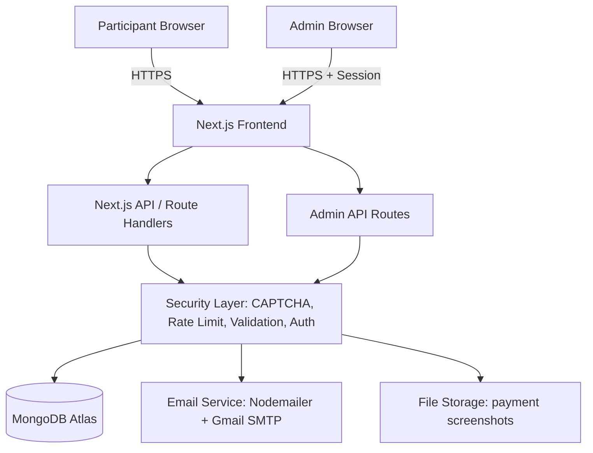
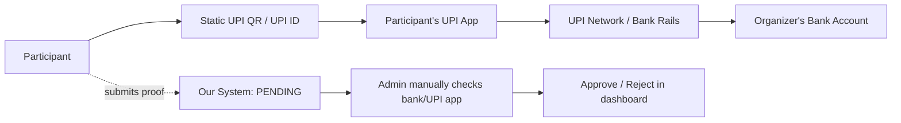
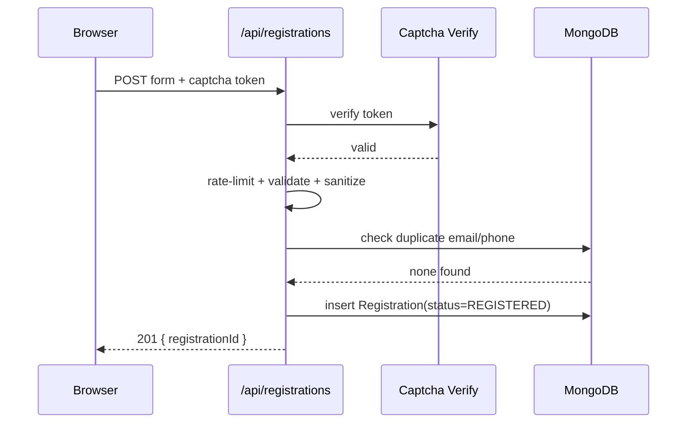
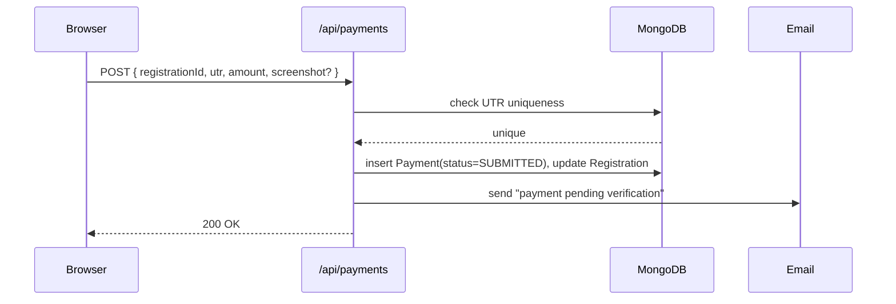
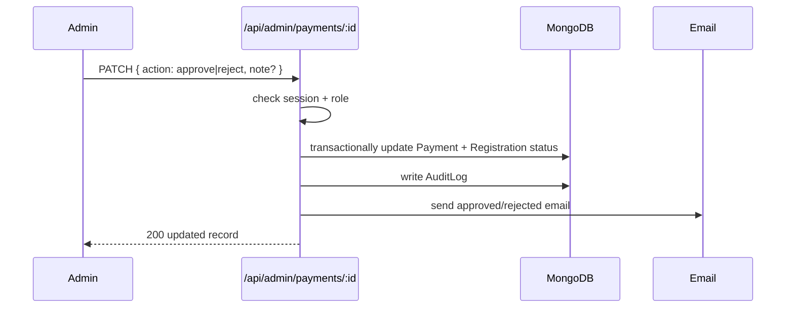
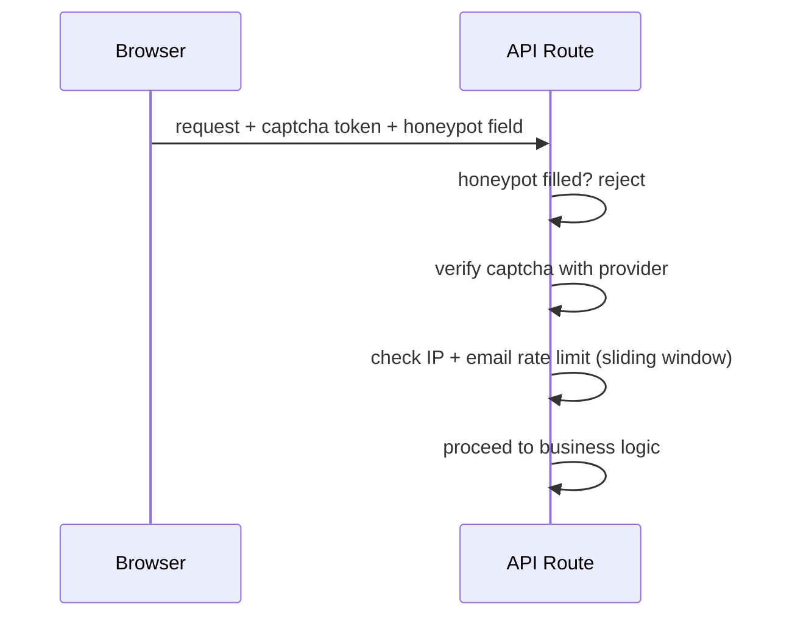
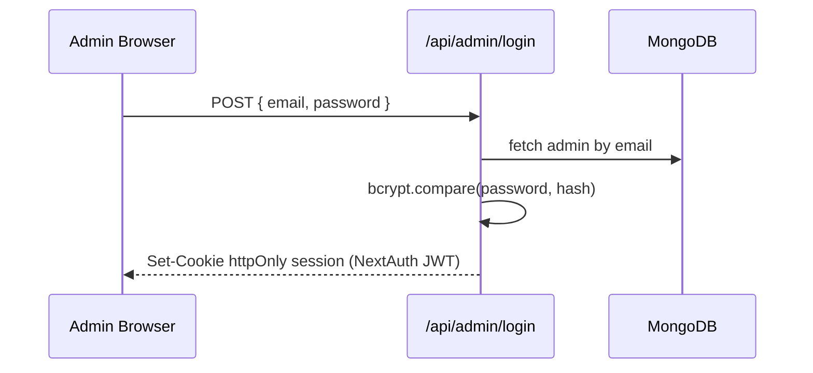
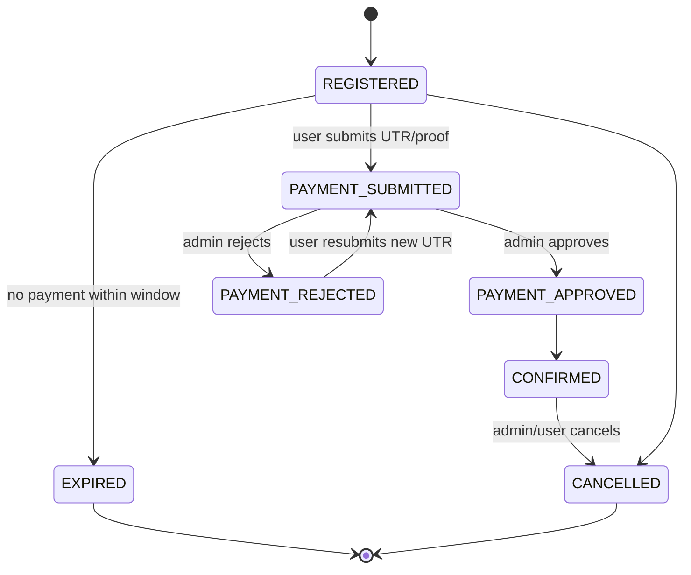

# SRM DBUG Labs — Event Registration Platform
### Complete Product & Architecture Specification

Stack: Next.js (TS) + MongoDB Atlas + Google SMTP + Manual UPI Payment Verification

---

## PART 1 — PRD (Product Requirements Document)

### 1.1 Product Overview
A registration + manual-payment-verification web platform for SRM DBUG Labs events. Participants discover the event, register, pay via a fixed UPI QR, submit proof, and get emailed once an admin verifies the payment. Admins manage registrations, verify payments, and communicate with participants from a dashboard.

### 1.2 Problem Statement
Club events currently rely on Google Forms + spreadsheets + manual UPI screenshots shared over WhatsApp/email — slow, error-prone, no single source of truth, no fraud prevention, no automated participant communication, no visibility into payment status.

### 1.3 Goals
- One clean flow: discover → register → pay → get verified → get confirmed.
- Manual-but-structured payment verification (no gateway available).
- Strong duplicate/fraud/bot resistance at the registration and payment-proof layer.
- Admin dashboard giving real-time visibility and control.
- Theme-agnostic: current Alice-in-Borderland look is CSS/content only, swappable later.

### 1.4 Non-Goals
- No automatic bank-side payment verification (no gateway/API exists).
- No refund automation / no real payment processing.
- No multi-event marketplace — this is single-event-at-a-time per deployment (though schema allows multiple `Event` docs for future reuse).
- No native mobile app.

### 1.5 Target Users
- **Participants** — SRM students (mostly mobile, submitting under time pressure around deadlines).
- **Organizers** (club core team) — non-technical-ish, need a simple dashboard.
- **Admins / Verification Admins** — verify payments, manage data, send emails.

### 1.6 User Stories
- As a participant, I want to understand the event, rules, and fee before registering.
- As a participant, I want to register in under 2 minutes from my phone.
- As a participant, I want to know my registration ID and current status at any time.
- As a participant, I want a clear payment screen with QR, UPI ID, and exact amount.
- As a participant, I want an email at every important status change.
- As an admin, I want a queue of pending payments with all proof visible in one place.
- As an admin, I want to approve/reject with one click and an optional reason.
- As an admin, I want to search/filter/export registrations.
- As an admin, I want to resend any email.
- As a super admin, I want to control who has admin access.

### 1.7 Functional Requirements
- Public landing/info pages.
- Registration form with validation + bot protection.
- Registration ID generation.
- Payment instructions page (static QR, UPI ID, exact fee).
- Payment-proof submission (UTR + metadata + optional screenshot).
- Registration/payment state machine, persisted in MongoDB.
- Transactional emails at each state transition.
- Admin authentication (RBAC: Super Admin, Admin, Verification Admin).
- Admin dashboard: KPIs, registration/payment management, email tools, audit log, event settings.
- CSV export.

### 1.8 Non-Functional Requirements
- **Security**: server-side validation everywhere, RBAC, hashed admin credentials, CAPTCHA, rate limiting, sanitized inputs, secrets never in client bundle.
- **Performance**: registration + payment endpoints respond < 500ms under normal load; handle bursts of ~500 concurrent submissions on serverless.
- **Scalability**: stateless API routes, MongoDB indexes, horizontal scaling via Vercel's serverless model.
- **Availability**: target 99.5% (acceptable for a college club — no multi-region requirement).
- **Accessibility**: WCAG-AA-reasonable — proper labels, contrast, keyboard nav, since dark theme risks low contrast.
- **Mobile responsiveness**: mobile-first, since most participants register on phones.
- **Data integrity**: unique indexes on email/phone/UTR, atomic status transitions.
- **Privacy**: minimal data collection, admin-only access to PII, retention policy.

### 1.9 Acceptance Criteria (representative)
- Registration form cannot submit without passing CAPTCHA + all required fields + server validation.
- Duplicate email/phone for the same event is rejected with a clear message and a link to check existing status.
- Same UTR can never be attached to two registrations (unique index enforced).
- Admin cannot approve a payment without the record moving atomically from `PAYMENT_SUBMITTED` → `PAYMENT_APPROVED` → `CONFIRMED`, with an audit log entry created.
- Every state transition triggers exactly one corresponding email (idempotent — no duplicate sends on retry).
- Admin panel returns 401/403 for any unauthenticated/unauthorized request, including direct API calls.

---

## PART 2 — HLD (High-Level Design)



**Payment flow (organizer never sees money move automatically):**


Our application is never connected to the bank. It only records what the participant *claims* they paid; the admin cross-checks against the real UPI/bank app manually. This distinction — **submitted vs verified** — is enforced everywhere in the state machine and UI copy.

---

## PART 3 — LLD (Sequence Diagrams)

**Registration sequence**


**Payment submission sequence**


**Admin verification sequence**


**Bot protection sequence**


**Auth sequence (admin)**


**Registration state machine**


---

## PART 4 — Database Design (MongoDB)

Collections actually needed: **Event, Registration, Payment, Admin, EmailLog, AuditLog, AbuseLog**.
A separate `User`/participant-account collection is **not needed** — participants don't log in; identity lives on the `Registration` document itself. This avoids unnecessary auth surface for participants.

### `Event`
```
{
  _id, slug: "dbug-hack-2026" (unique),
  name, description, dateStart, dateEnd, venue,
  feeAmount, feeCurrency: "INR",
  upiId, upiQrImageUrl,
  capacity, registrationDeadline,
  registrationOpen: Boolean,
  createdAt, updatedAt
}
```
Indexes: unique on `slug`.

### `Registration`
```
{
  _id, registrationId: "DBUG-2026-8F42K" (unique, indexed),
  eventId (ref Event),
  fullName, email (lowercased), phone,
  college, department, year,
  teamName?, teamMembers?: [{name,email,srmId?}],
  consent: { terms: true, privacy: true, comms: Boolean },
  status: "REGISTERED"|"PAYMENT_SUBMITTED"|"PAYMENT_APPROVED"|
          "PAYMENT_REJECTED"|"CONFIRMED"|"CANCELLED"|"EXPIRED",
  createdAt, updatedAt, expiresAt
}
```
Indexes: unique `registrationId`; **compound unique** on `{eventId, email}` and `{eventId, phone}` (prevents duplicate reg per event, allows same person across different events).

### `Payment`
```
{
  _id, registrationId (ref, indexed),
  utr (unique, indexed), amount, payerName, paidAt,
  screenshotUrl?,
  status: "SUBMITTED"|"APPROVED"|"REJECTED",
  reviewedBy (ref Admin)?, reviewedAt?, rejectionReason?, adminNote?,
  createdAt
}
```
Indexes: unique `utr`; index on `status` for the pending-verification queue.
Separate collection from `Registration` — **yes, deliberately** (see Part 6) so one registration can have multiple payment attempts (rejected → resubmitted) without losing history.

### `Admin`
```
{ _id, email(unique), passwordHash, role: "SUPER_ADMIN"|"ADMIN"|"VERIFIER",
  isActive: Boolean, createdAt, lastLoginAt }
```

### `EmailLog`
```
{ _id, registrationId, type, to, subject, status: "SENT"|"FAILED",
  error?, sentAt }
```
Used to prevent duplicate sends and for admin-facing "resend" history.

### `AuditLog`
```
{ _id, actorAdminId, action, targetCollection, targetId,
  before?, after?, ip, createdAt }
```

### `AbuseLog`
```
{ _id, ip, endpoint, reason, createdAt }  // TTL index, auto-expire after 30 days
```

---

## PART 5 — API Design

| Method | Endpoint | Auth | Notes |
|---|---|---|---|
| GET | `/api/events/:slug` | none | public event info |
| POST | `/api/registrations` | none + CAPTCHA | rate-limited, dedupe check, creates `REGISTERED` |
| GET | `/api/registrations/:id/status` | none (by registrationId, no PII returned) | status lookup |
| POST | `/api/payments` | none + rate limit | attaches proof, UTR uniqueness enforced, `PAYMENT_SUBMITTED` |
| POST | `/api/admin/login` | none (this IS the auth endpoint) | bcrypt + session cookie |
| GET | `/api/admin/registrations` | session, role: any admin | filter/search/paginate |
| PATCH | `/api/admin/registrations/:id` | session | edit / archive (soft) |
| GET | `/api/admin/payments?status=SUBMITTED` | session | verification queue |
| PATCH | `/api/admin/payments/:id` | session, role: ADMIN/VERIFIER | approve/reject, transactional, writes AuditLog + email |
| POST | `/api/admin/emails/resend` | session | resend any templated email |
| GET | `/api/admin/analytics` | session | computed KPIs |
| GET | `/api/admin/export` | session, role: ADMIN+ | CSV stream |
| GET/PATCH | `/api/admin/event` | session, role: SUPER_ADMIN for sensitive fields | UPI ID/QR/fee gated separately |
| GET/POST/PATCH | `/api/admin/admins` | session, role: SUPER_ADMIN | manage admin users |

All mutating endpoints: validate with a schema library (zod), sanitize strings, enforce payload size limits, and re-check business rules server-side regardless of client state.

---

## PART 6 — Payment Architecture (the core hard problem)

**1. Registration before payment?** Yes. Registration is created first (`REGISTERED`), independent of payment, so we always have an addressable record even if the user abandons before paying.

**2. Separate entities for Registration and Payment?** Yes — one-to-many. A rejected payment shouldn't destroy registration history; a user can resubmit a new UTR against the same registration.

**3. Prevent duplicate registrations?** Compound unique index `{eventId, email}` and `{eventId, phone}` at the DB layer (not just app-layer check) — this is the actual source of truth, immune to race conditions.

**4. Prevent UTR reuse?** Unique index on `Payment.utr`. Insert attempt with duplicate UTR fails atomically; return a clear "this transaction ID has already been used" error.

**5. Users who register but never pay?** `expiresAt` field + scheduled job (or lazy check on read) flips status to `EXPIRED` after e.g. 48–72 hours, freeing the "reserved" slot if capacity is enforced.

**6. Browser closed mid-payment?** No problem — registration persists at `REGISTERED`; user can return via their registration ID link and resume at the payment step.

**7. Double form submission?** Idempotency key (see Part 19) + unique indexes make a second identical submit a safe no-op/clear error, not a duplicate row.

**8. Fake screenshot?** We do **not** claim to detect this automatically. Mitigate by: requiring UTR (checkable in the organizer's actual UPI app/bank statement) as the primary verification field, screenshot as supporting evidence only, and admin manually cross-referencing UTR + amount + time against the real bank/UPI statement before approving.

**9. Manual verification UX:** Admin queue sorted oldest-first, shows UTR/amount/payer name/screenshot/registration details side by side; one-click Approve/Reject with mandatory reason on reject.

**10. Disputes?** `adminNote` + `rejectionReason` fields, plus AuditLog, give a paper trail; participant can resubmit or contact organizers via listed contact info.

**11. Static or dynamic QR?** **Static**, fixed UPI ID/QR configured once per event in `Event.upiId/upiQrImageUrl`. Dynamic per-user QR generation adds complexity with no real fraud benefit here, since we still can't auto-verify without a gateway.

**12. Registration expiry?** Yes — configurable window (e.g. 72h) after which unpaid `REGISTERED` rows move to `EXPIRED` and (if capacity-limited) release their reserved seat.

**13. Refunds/cancellations?** Represented as explicit statuses (`CANCELLED`, `REFUNDED` if ever needed) with an admin note; actual money movement happens manually outside the system (UPI reverse transfer), the system only records that it happened.

**Explicit distinction enforced everywhere:** UI copy, emails, and DB status names always separate **"payment submitted by participant"** (`PAYMENT_SUBMITTED`) from **"payment verified by organizer"** (`PAYMENT_APPROVED`/`CONFIRMED`). Nothing in the copy implies automatic bank confirmation.

---

## PART 7 — Bot / Spam / Security Architecture

**Flow:** Browser → CAPTCHA token → Next.js API → verify CAPTCHA server-side → rate-limit check (IP + email + phone sliding window) → honeypot field check → payload validation (zod) → duplicate check against unique indexes → MongoDB write.

- **CAPTCHA**: Cloudflare Turnstile — free, privacy-friendlier than reCAPTCHA, simple Next.js integration, invisible-by-default widget suits the dark game-like theme well.
- **Rate limiting**: per-IP and per-email sliding-window limiter (e.g. Upstash Redis or in-memory+Atlas-backed counter if avoiding another service) on `/api/registrations` and `/api/payments`.
- **Honeypot**: hidden form field; any bot filling it is silently rejected (200 OK, no-op) to avoid tipping off scrapers.
- **CSRF**: same-site cookies for admin session + origin header check on state-changing routes.
- **Duplicate detection**: DB-level unique indexes are the real guard; app-level pre-check is just for better UX/error messages.
- **File upload limits**: max 3–5MB, JPEG/PNG only, MIME-type sniffed server-side (not trusted from filename), re-encoded/compressed on upload to strip metadata.
- **Abuse logging**: failed CAPTCHA, rate-limit hits, and rejected honeypot submissions logged to `AbuseLog` (TTL-expired) — never log full payment screenshots or raw PII in logs.

Never rely on client-side validation alone — every rule above is re-checked server-side regardless of what the browser sent.

---

## PART 8 — File Upload Security (Payment Screenshots)

- Max size: 5MB; allowed types: `image/jpeg`, `image/png`, `image/webp` — verified by magic-byte sniffing, not extension.
- Filenames are server-generated (UUID), never the user's original filename.
- Images are re-compressed (e.g. via `sharp`) on the server before storage — this both saves space and strips embedded metadata/EXIF.
- **MongoDB should store only a URL/reference, never the binary** — MongoDB isn't a file store and binary blobs bloat the working set and backups.
- **Storage recommendation**: Cloudinary (generous free tier, built-in image transforms, simple SDK) or S3-compatible storage (Cloudflare R2 — free egress) if the team wants full control. For a student club, **Cloudinary is the practical pick** — least setup.
- Access control: uploaded image URLs are unguessable (random public IDs) and only surfaced inside the authenticated admin dashboard; not linked anywhere public.
- Retention: screenshots deleted automatically ~90 days after event completion (script or storage lifecycle rule), consistent with data-minimization.

Additional service required: an image-hosting provider (Cloudinary/R2) — flagged explicitly since it's outside the core Next.js/MongoDB/SMTP stack.

---

## PART 9 — Email System (Nodemailer + Gmail SMTP)

Events triggering email: `registration_received`, `payment_pending` (on submit), `payment_approved`, `payment_rejected`, `registration_cancelled`, `event_reminder` (optional, admin-triggered broadcast), `admin_resend` (reuses any of the above templates).

- Each email: HTML + plain-text fallback, includes registrationId, name, event name/date/venue, current status, and contact info.
- Templates live as functions in `emails/` returning `{subject, html, text}` — no inline HTML in route handlers.
- SMTP credentials (`SMTP_USER`, `SMTP_PASSWORD` — a **Gmail App Password**, not the real account password) live only in server-side env vars.
- Gmail SMTP has practical sending limits (~500/day on a regular account) — acceptable for club-scale events; if exceeded, queue and retry, and surface a warning to admins.
- Every send attempt (success or failure) is written to `EmailLog`; the "resend" button in the admin panel reuses the same template with a note that it's a manual resend, and is itself idempotent (won't double-queue if clicked twice quickly — debounced client-side + checked server-side).
- Retry: on SMTP failure, retry twice with backoff, then mark `FAILED` in `EmailLog` and surface it in the admin email-logs view for manual resend.

---

## PART 10 — Admin Panel

**RBAC:**
- **Super Admin** — everything, including managing other admins and editing sensitive event settings (UPI ID/QR, fee amount, capacity).
- **Admin** — full registration/payment/email management, exports; cannot edit sensitive event settings or manage admin users.
- **Verification Admin** — can only view and approve/reject payments; cannot edit registrations, event settings, or admin users.

**Sensitive settings that should NOT be casually editable** (Super Admin only, with a confirmation step): `upiId`, `upiQrImageUrl`, `feeAmount` — changing these mid-event silently would corrupt in-flight payments' correctness.

**Dashboard (first screen on login):** KPI cards → registration trend graph → payment status graph → pending-verification queue (highest priority, shown prominently) → recent registrations → recent admin activity feed.

**KPIs that are reliably computable** (avoid inventing metrics we can't back): total registrations, confirmed count, pending-verification count, approved/rejected counts, today's registrations, revenue collected (sum of approved payments), payment conversion rate (confirmed/registered), capacity utilization. *Not included*: anything implying real-time bank balance or "money received" beyond what's manually approved.

**Sidebar:** Dashboard · Registrations · Payments · Participants · Emails · Event Settings · Admin Users · Audit Logs.

---

## PART 11 — CRUD & Deletion Policy

| Entity | Create | Read | Update | Delete |
|---|---|---|---|---|
| Registration | via public form | admin + status lookup | admin edit fields | **soft-delete/archive only** |
| Payment | via public form | admin | status change only (approve/reject) | never hard-deleted |
| Event | admin (Super Admin) | public (safe fields) / admin (full) | Super Admin | soft-disable, not delete |
| Admin user | Super Admin | Super Admin | Super Admin (role/active) | disable, not delete |

Hard delete is disallowed on Registration/Payment/Admin/AuditLog for audit-integrity reasons — a club event involves money, and every approve/reject/edit must remain traceable.

---

## PART 12 — Security Architecture Summary

- **Auth**: NextAuth.js (Auth.js) with Credentials provider for admins, bcrypt-hashed passwords, JWT stored in an **HTTP-only, secure, same-site cookie** (not localStorage — avoids XSS token theft).
- **Why this over Google OAuth or fully custom auth**: Google OAuth would tie admin identity to personal Gmail accounts (awkward for club handover between years); a fully custom session system reinvents what NextAuth already does securely. NextAuth + Credentials is the simplest secure middle ground for a small, known set of admins.
- **RBAC**: role stored in the JWT/session, checked in middleware on every `/api/admin/*` route, not just hidden in the UI.
- **Input safety**: zod schemas server-side on every mutating route; MongoDB driver's parameterized queries prevent NoSQL injection (never build queries from raw string concatenation).
- **Headers**: standard secure headers (CSP, X-Frame-Options, Referrer-Policy) via `next.config.js`; HTTPS enforced (Vercel default).
- **CORS**: API routes only accept same-origin requests (admin panel isn't a public API).
- **Secrets**: all in environment variables, never in client bundles — enforced by only referencing them in server components/route handlers, never `NEXT_PUBLIC_*` for anything sensitive.
- **Admin panel hardening**: rate-limited login endpoint, generic "invalid credentials" errors (no email enumeration), session expiry + re-auth for sensitive actions (editing event settings, managing admins).

---

## PART 13 — Error Handling (selected)

| Scenario | Behavior |
|---|---|
| MongoDB unavailable | API returns 503 with friendly "please try again shortly"; nothing partially written (fail closed) |
| Email fails | Registration/payment still succeeds; `EmailLog` marks FAILED; admin can resend |
| CAPTCHA fails | 400 with "verification failed, please retry" |
| Upload fails | Form allows retry without losing already-entered fields (client keeps state) |
| Duplicate UTR | 409 "This transaction ID has already been submitted" |
| Event full | Registration blocked with waitlist option if enabled |
| Deadline passed | Registration form disabled, shows deadline message |
| SMTP quota exceeded | Queue for retry, log, notify admin via dashboard banner |
| Admin misclicks reject | Reject is reversible: status can be moved back to `PAYMENT_SUBMITTED` by an admin, logged in AuditLog |

---

## PART 14 — Idempotency & Duplicate Submission

- Client generates a request-scoped idempotency key (e.g. UUID stored in a hidden field/localStorage per form session); server checks/stores it briefly (short-TTL collection or cache) so a retried network request is a safe no-op.
- Submit buttons disabled immediately on click (prevents double-click).
- Ultimate guarantee is still the **DB-level unique indexes** on `{eventId,email}`, `{eventId,phone}`, and `utr` — idempotency keys improve UX, uniqueness constraints guarantee correctness even under race conditions.

---

## PART 15 — Capacity Handling

`Event.capacity` + a maintained `confirmedCount` (or a computed count query). Under a burst (105 requests for 100 seats), the registration insert itself doesn't reserve a seat — only `PAYMENT_APPROVED`/`CONFIRMED` counts toward capacity, checked with an atomic `findOneAndUpdate` using a conditional filter (`confirmedCount < capacity`) at approval time, so the race is resolved at the point of admin approval, not at registration time. Registrations beyond capacity can still be accepted onto a waitlist (`status: WAITLISTED`) and promoted if someone cancels.

---

## PART 16 — Project Structure

```
app/
  (public)/[eventSlug]/page.tsx
  (public)/[eventSlug]/register/page.tsx
  (public)/[eventSlug]/payment/[registrationId]/page.tsx
  (public)/[eventSlug]/status/[registrationId]/page.tsx
  admin/login/page.tsx
  admin/dashboard/page.tsx
  admin/registrations/page.tsx
  admin/payments/page.tsx
  admin/emails/page.tsx
  admin/settings/page.tsx
  api/registrations/route.ts
  api/payments/route.ts
  api/admin/... 
components/          # shared UI (theme-agnostic)
lib/                 # db connection, rate-limit, captcha, mailer
models/              # mongoose/zod schemas
services/            # business logic (registrationService, paymentService)
validators/          # zod schemas
emails/              # email templates
middleware.ts        # auth/role checks for /admin and /api/admin
types/
```

---

## PART 17 — Environment Variables

**Secret (server-only):**
`MONGODB_URI`, `SMTP_HOST`, `SMTP_PORT`, `SMTP_USER`, `SMTP_PASSWORD`, `NEXTAUTH_SECRET`, `CAPTCHA_SECRET`, `CLOUDINARY_API_SECRET`

**Public (safe to expose):**
`NEXT_PUBLIC_CAPTCHA_SITE_KEY`, `NEXT_PUBLIC_EVENT_SLUG`

**Config (server, non-secret but not user-facing):**
`UPI_ID`, `EVENT_FEE`, `REGISTRATION_EXPIRY_HOURS`

---

## PART 18 — Deployment, Observability, Testing (condensed)

- **Deploy**: Vercel (frontend+API) → MongoDB Atlas (M0/free tier is enough) with IP allowlist restricted to Vercel's ranges or use Atlas's VPC peering if available → Cloudinary for images → Gmail SMTP.
- **Environments**: local `.env.local` → Vercel Preview deployments per PR → Production on merge to main.
- **Backups**: Atlas automatic daily backups (even on free/shared tiers where available; otherwise a scheduled export script).
- **Observability**: structured logs for registration attempts, CAPTCHA failures, rate-limit hits, payment submissions/verifications, email failures, admin actions — never log full PII payloads or screenshot contents.
- **Testing priorities**: duplicate registration, duplicate UTR, double-submit, bot/no-captcha request, oversized/invalid file, unauthorized admin API access, event-full behavior, deadline-passed behavior, email retry/failure path.

---

## PART 19 — Final Recommended Architecture & Build Order

**Recommended stack (final):** Next.js + TypeScript API routes, MongoDB Atlas with the schema above, NextAuth (Credentials) for admin auth, Cloudflare Turnstile for CAPTCHA, Cloudinary for screenshots, Gmail SMTP via Nodemailer, deployed on Vercel. This is secure, free/near-free to run, and small enough for a student team to fully understand and maintain.

**BUILD ORDER:**
1. MongoDB schema + Mongoose/zod models + DB connection utility.
2. Event + public landing/info pages (static content, no theme dependency yet).
3. Registration API + form + CAPTCHA + rate limiting + unique indexes.
4. Payment submission API + payment page (QR, UPI ID, UTR form) + Cloudinary upload.
5. Email system (templates + Nodemailer + EmailLog).
6. Admin auth (NextAuth + RBAC middleware).
7. Admin dashboard: payment verification queue (highest priority feature).
8. Admin registration management + export + email resend.
9. Audit logging + capacity/waitlist logic + expiry job.
10. Apply the real Alice-in-Borderland UI once provided (isolated to components/Tailwind theme — no backend changes needed).
